常见数据库及在线工具的使用

***

 

 

# Outline

**[前言](#前言)**

- [科学上网工具](#科学上网工具) | [🌍网址](https://duangcloud.site/#/dashboard)
- [Database Commons——全球生物数据库的精选目录](#Database-Commons——全球生物数据库的精选目录) | [🌍网址](https://ngdc.cncb.ac.cn/databasecommons/help)

 

**[类ChatGPT网站](#类ChatGPT网站)**

- [ChatGPT](#ChatGPT) | [🌍网址](https://chatgpt.com/)
- [Perplexity AI](#Perplexity-AI) | [🌍网址](https://www.perplexity.ai/)

 

**[文献检索网站](#文献检索网站)**

- [NCBI-PubMed——最常用的文献检索工具](#NCBI-PubMed——最常用的文献检索工具) | [🌍网址](https://pubmed.ncbi.nlm.nih.gov/)
- [Semantic Scholar——AI辅助文献搜索](#Semantic-Scholar——AI辅助文献搜索) | [🌍网址](https://www.semanticscholar.org/)
- [谷歌学术和谷歌学术镜像](#谷歌学术和谷歌学术镜像)| [🌍谷歌学术](#https://scholar.google.com.hk/?hl=zh-CN)[🌍谷粉搜搜](#http://gfsoso.me/)[🌍谷粉学术](https://gfsoso.99lb.net/)
- [SCI Hub数据库——免费下载全文](#SCI-Hub数据库——免费下载全文) | [🌍网址](https://tool.yovisun.com/scihub/)

 

**[文献阅读工具与插件](#文献阅读工具与插件)**

- [EasyPubMedicine——使PubMed更好用](#EasyPubMedicine——使PubMed更好用)
- [DeepL——全世界最准确的翻译器](#DeepL——全世界最准确的翻译器)
- [Txyz.ai——AI阅读文献](#Txyz.ai——AI阅读文献) | [🌍网址](https://app.txyz.ai/)
- [SciSpace——AI阅读文献](#SciSpace——AI阅读文献) | [🌍网址](https://typeset.io/)

 

**[核酸数据库](#核酸数据库)**

- [NCBI genebank——最常用gene检索工具](#NCBI-genebank——最常用gene检索工具) | [🌍网址](https://www.ncbi.nlm.nih.gov/genbank/)
- [Ensemble——基因组数据库](#Ensemble——基因组数据库) | [🌍网址](https://www.ensembl.org/index.html)
- [GeneCards——人类基因综合数据库](#GeneCards——人类基因综合数据库) | [🌍网址](https://www.genecards.org/)

 

**[蛋白质数据库](#蛋白质数据库)**

- [Uniprot——资源最广、信息最丰富的蛋白质数据库](#Uniprot——资源最广、信息最丰富的蛋白质数据库) | [🌍网址](https://www.uniprot.org/)
- [RCSB PDB——生物大分子结构数据库](#RCSB-PDB——生物大分子结构数据库) | [🌍网址](https://www.rcsb.org/)
- [AlphaFold——AI预测蛋白质三维结构](#AlphaFold——AI预测蛋白质三维结构) | [🌍网址](https://alphafold.ebi.ac.uk/)
- [AlphaFold server——基于序列的结构与分子互作预测](#AlphaFold-server——基于序列的结构与分子互作预测) | [🌍网址](https://alphafoldserver.com/)
- [Proteinatlas——人类蛋白质图谱数据库](#Proteinatlas——人类蛋白质图谱数据库) | [🌍网址](https://www.proteinatlas.org/)
- [InterPro——蛋白质结构域数据库](#InterPro——蛋白质结构域数据库) | [🌍网址](https://www.ebi.ac.uk/interpro/)
- [CATH——蛋白质结构分类数据库](#CATH——蛋白质结构分类数据库) | [🌍网址](https://cathdb.info/)
- [SCOPe——蛋白质进化关系分类数据库](#SCOPe——蛋白质进化关系分类数据库) | [🌍网址](https://scop.berkeley.edu/)
- [DSSP——获取蛋白质二级结构文件](#DSSP——获取蛋白质二级结构文件) | [🌍网址](https://swift.cmbi.umcn.nl/gv/dssp/)
- [PSIPRED——预测蛋白质的二级结构](#PSIPRED——预测蛋白质的二级结构) | [🌍网址](http://bioinf.cs.ucl.ac.uk/psipred/)
- [蛋白质的翻译后修饰位点预测—DTU](#蛋白质的翻译后修饰位点预测—DTU) | [🌍DTU](https://services.healthtech.dtu.dk/)

 

**[标识符Identifier转换工具](#标识符Identifier转换工具)**

- [🌍g:Convert](https://biit.cs.ut.ee/gprofiler/convert)[🌍biotools](https://biotools.fr/)[🌍bioDBnet](https://biodbnet.abcc.ncifcrf.gov/)

 

**[富集分析相关网站](#富集分析相关网站)**

- [STRING——蛋白质互作数据库](#STRING——蛋白质互作数据库) | [🌍网址](https://string-db.org/cgi/input?sessionId=bln2w9LAErVv&input_page_show_search=on)
- [GO](#GO) | [🌍网址](https://www.geneontology.org/)
- [KEGG](#KEGG) | [🌍网址](https://www.genome.jp/kegg/)
- [Reactome](#Reactome) | [🌍网址](https://reactome.org/)
- [GeneAnalytics——多个数据库富集分析](#GeneAnalytics——多个数据库富集分析) | [🌍网址](https://ga.genecards.org/#input)
- [Enrichr——多个数据库富集分析](#Enrichr——多个数据库富集分析) | [🌍网址](https://maayanlab.cloud/Enrichr/)
- [GSEA——推断通路上下调](#GSEA——推断通路上下调) | [🌍网址](https://www.gsea-msigdb.org/gsea/index.jsp)
- [clusterProfiler——最强富集分析工具](#clusterProfiler——最强富集分析工具) | [🌍网址](https://yulab-smu.top/biomedical-knowledge-mining-book/)

 

**[序列比较相关网站](#序列比较相关网站)**

- [如何评估序列相似？](#如何评估序列相似？)
- [常见的DNA替换记分矩阵](#常见的DNA替换记分矩阵)
- [常见的蛋白替换记分矩阵](#常见的蛋白替换记分矩阵)
- [双序列比较——打点法](#双序列比较——打点法)
- [打点法网站](#打点法网站) | [🌍Dotlet](https://dotlet.vital-it.ch/)
- [双序列比对alignment](#双序列比对alignment)
- [双序列比对alignment网站](#双序列比对alignment网站) | [🌍EBML_PSA](https://www.ebi.ac.uk/jdispatcher/psa)
- [多序列比较——BLAST](#多序列比较——BLAST)
- [BLAST网站](#BLAST网站) | [🌍NCBI BLAST](https://blast.ncbi.nlm.nih.gov/Blast.cgi) [🌍EBMI_BLAST/SSEARCH/FASTA](https://www.ebi.ac.uk/jdispatcher/sss)[🌍Uniprot BLAST](https://www.uniprot.org/blast)[🌍WU-BLAST](https://bioinfo-mml.sjtu.edu.cn/cgi-bin/TADB2/nph-blast-TADB.pl) [🌍UCSC-BLAT](https://genome.ucsc.edu/cgi-bin/hgBlat)
- [多序列比对multiple alignment](多序列比对multiple-alignment)
- [多序列比对multiple alignment网站](#多序列比对multiple-alignment网站) | [🌍EMBL MSA](https://www.ebi.ac.uk/jdispatcher/msa)[🌍TCOFFEE](https://tcoffee.crg.eu/apps/tcoffee/index.html)[🌍Uniport align](https://www.uniprot.org/align)
- [寻找保守区域Motif](#寻找保守区域Motif) | [🌍WebLogo](https://weblogo.threeplusone.com/)[🌍MEME](http://meme-suite.org/)
- [JASPAR——转录因子图谱](#JASPAR——转录因子图谱)| [🌍JASPAR](https://jaspar.elixir.no/)

 

**[引物设计](#引物设计)**

- [Primerbank——引物数据库](#Primerbank——引物数据库) | [🌍网址](https://pga.mgh.harvard.edu/primerbank/)
- [Primer3Plus——在线设计引物](#Primer3Plus——在线设计引物) | [🌍网址](https://www.primer3plus.com/index.html)
- [Primer-BLAST——引物特异性验证](#Primer-BLAST——引物特异性验证) | [🌍网址](https://www.ncbi.nlm.nih.gov/tools/primer-blast/index.cgi?LINK_LOC=BlastHome)

 

**[Other](#Other)**

- [英文写作润色工具](#英文写作润色工具) | [🌍Quillbot](https://quillbot.com/) [🌍Grammerly](https://app.grammarly.com/) [🌍DeepL](https://www.deepl.com/zh/translator)
- [BioRender——收费性生物绘图工具](#BioRender——收费性生物绘图工具) | [🌍网址](https://www.biorender.com/) 
- [protocols.io——共享protocol网站](#protocols.io——共享protocol网站) | [🌍网址](https://www.protocols.io/)
- [ATCC——细胞种类大全](#ATCC——细胞种类大全) | [🌍网址](https://www.atcc.org/)
- [一些宝藏的up主和视频——都点点看看吧！](#一些宝藏的up主和视频——都点点看看吧！)

***
  

# 前言

* 本笔记对数据库的介绍 **📚 广度一般，深度较浅**，如果想真正了解某个数据库，还是点进去网站多探索与尝试一下吧！🔍  

* 本笔记持续更新与维护 🔄，如果发现什么**好玩、有趣的数据库** 🧩，欢迎发邮件至 📧 **1106171239@qq.com**，我会及时进行更新 ✨。  

* 本笔记会在 **GitHub** 上更新 🛠️，欢迎大家来关注 🌟 [**我的GitHub**](https://github.com/sunv28)。  
  👉 [**我的GitHub**](https://github.com/sunv28) 上还有一些关于生信的笔记 📖，大家可以自行查阅下载 🖱️💾！  

* 注册一个谷歌账户，一些网站需要登陆才能使用，拥有一个谷歌账户可以在许多网站免去注册。**需要科学上网**

***
 

 

## 科学上网工具

* 许多网站需要科学上网工具才能使用，有些网站的视频教程也是youtube教程，这里我推荐一个机场[Duangcloud](https://duangcloud.site/#/dashboard)

**优点**
> 速度快 
> 可以许多台机器一起使用 
> 可以在不同的平台使用（安卓，iso(需要Shadowrocket软件)，MACos，Windows） 
> 有兴趣的大家一起合伙买一个套餐 

**缺点**
>每个月的流量是限定，不同套餐流量不同

***
 
 

## Database Commons——全球生物数据库的精选目录

* [Database Commons官网](https://ngdc.cncb.ac.cn/databasecommons/)

* Database Commons 是一个全球生物数据库的精选目录，旨在提供 全球生物数据库的完整布局，可轻松检索和访问感兴趣的数据库的特定集合。

***
 
 

# 类ChatGPT网站

## ChatGPT
* [ChatGPT网站](https://chatgpt.com/)

* 优点：3.5版本免费，有无限问答次数

* 缺点：需要科学上网，中国大陆注册比较困难，使用4.0需要收费（感觉3.5够用了）

***
 
 

## Perplexity AI

* [Perplexity AI网站](https://www.perplexity.ai/)

* ChatGPT和微软BING结合版，可以用谷歌账户登录注册

* 需要科学上网

***
 
 

# 文献检索网站

## NCBI-PubMed——最常用的文献检索工具

* [NCBI-PubMed网站](https://pubmed.ncbi.nlm.nih.gov/)

***
 
 

## Semantic Scholar——AI辅助文献搜索

[Semantic Scholar官网](https://www.semanticscholar.org/)

🚀 **高级语义理解能力**
* 使用 **自然语言处理 (NLP)**,
* 能准确理解搜索意图，返回更相关的结果，而不是简单匹配关键词。
* 例如：当用户搜索**machine learning in healthcare**时，系统能够理解这是在讨论**机器学习在医疗健康领域的应用**，而不仅仅是机器学习和医疗健康这两个词。

📊 **文献影响力与引用分析**  
- 提供详细的引用次数、影响力指标
- 能对引用次数、影响力指标进行排序

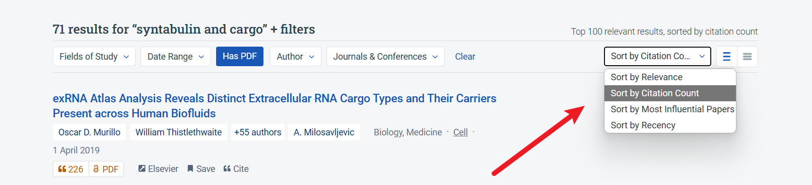

 
 

🚀 **高效的文献过滤与分类**  
- 支持按发表年份、引用次数、研究领域,作者等条件精细过滤

 
 

📑 **开放获取优先**  
* 标记并优先显示开放获取的论文

 
 

🔍 **智能推荐系统**  
基于用户的搜索历史、阅读记录和引用网络提供个性化推荐文献

* **基于文件夹内的论文推荐论文**

  可以基于你文件夹里收藏的论文，使用推荐算法去把和这些论文相关的论文推荐给你

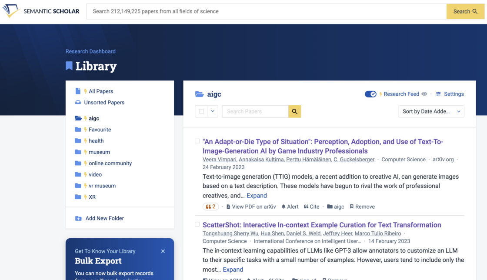

 
 

  如果你文件夹类别比较多的话，它也有 **View Your Research Feeds**选项，帮你选择你目前最感兴趣的几个文件夹去浏览推荐的论文。

 
 

* **基于单篇论文推荐论文**

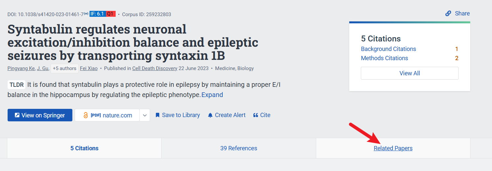

 
 

* **基于作者推荐论文**

  如果你有特别喜欢的作者，你可以关注这个作者，关注以后，如果这个作者有最新的论文，首页的论文推荐流里会有一个专门的板块提醒你所关注作者的最新论文。

***
 
 

## 谷歌学术和谷歌学术镜像
* [谷歌学术官网](#https://scholar.google.com.hk/?hl=zh-CN) ——需要科学上网

* 谷歌国内学术镜像——不需要科学上网

    * [谷粉搜搜官网](#http://gfsoso.me/)
    * [谷粉学术官网](https://gfsoso.99lb.net/)

***
 
 

## SCI Hub数据库——免费下载全文

* [SCI Hub数据库官网](https://tool.yovisun.com/scihub/)

* 注意：2021年及以后的新论文sci hub基本都没有（搜索结果为空白），请前往[科研通](https://www.ablesci.com/site/login)求助

***
 
 

# 文献阅读工具与插件

## EasyPubMedicine——使PubMed更好用

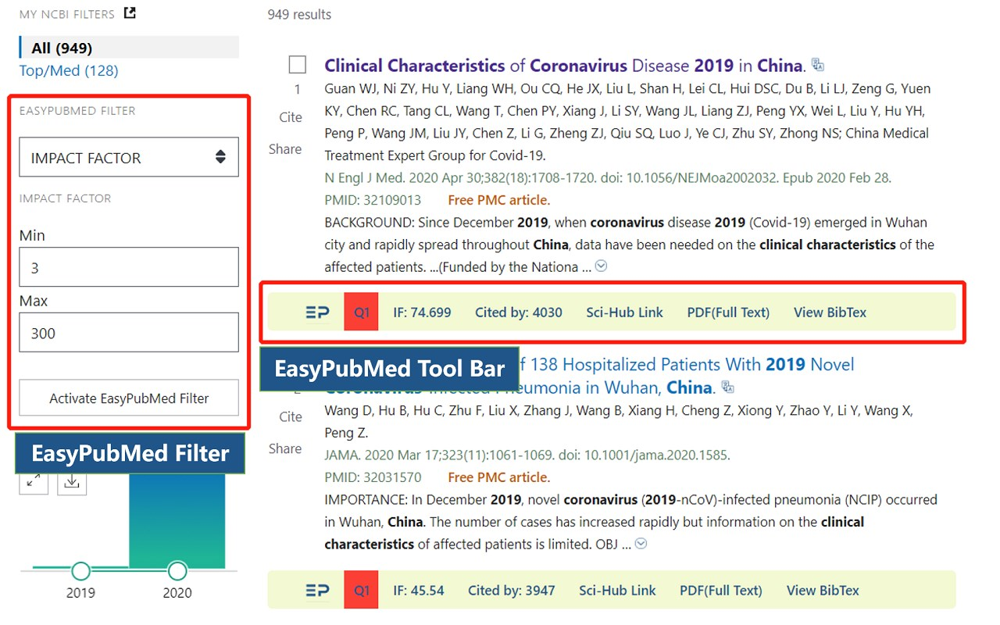

* 浏览器支持: Chrome, Edge

* [EasyPubMedicine Edge插件网站](https://microsoftedge.microsoft.com/addons/detail/easypubmedicine/daibhooimgnmhjagkkjamadijfambhid?hl=zh-CN)

* [EasyPubMedicine Chrome插件网站](https://chromewebstore.google.com/detail/easypubmedicine/nkpdpmomjhifdobiopmgfjjffacldfje?pli=1)

* [EasyPubMedicine说明书](https://github.com/naivenaive/EasyPubMed/blob/master/EasyPubMed%E4%BD%BF%E7%94%A8%E8%AF%B4%E6%98%8E.md)

---
 
 

## DeepL——全世界最准确的翻译器

* 优点：翻译文献非常精确，学术名词也能非常精准的翻译

* 缺点：免费版本看文章只能一段一段翻译（但也比较方便好用了，免费的也够用了），收费版能全文翻译，但价格非常昂贵。

* [DeepL 官网](https://www.deepl.com/zh/translator)

* [DeepL Edge插件网站](https://microsoftedge.microsoft.com/addons/detail/deepl%EF%BC%9A%E4%BA%BA%E5%B7%A5%E6%99%BA%E8%83%BD%E7%BF%BB%E8%AF%91%E5%99%A8%E5%92%8C%E5%86%99%E4%BD%9C%E5%8A%A9%E6%89%8B/fancfknaplihpclbhbpclnmmjcjanbaf)

* [DeepL Chrome插件网站](https://chromewebstore.google.com/detail/deepl%EF%BC%9A%E4%BA%BA%E5%B7%A5%E6%99%BA%E8%83%BD%E7%BF%BB%E8%AF%91%E5%99%A8%E5%92%8C%E5%86%99%E4%BD%9C%E5%8A%A9%E6%89%8B/cofdbpoegempjloogbagkncekinflcnj?utm_source=deeplcom-en&utm_medium=desktop-web&utm_campaign=pageID1406-d-first-button)

---
 
 

## Txyz.ai——AI阅读文献

* [Txyz.ai网站](https://app.txyz.ai/chat/e415ccf5-a82f-44df-82d6-fc1606747848)

* **可以本地上传pdf文件，也可以粘贴文献的地址，帮助我们快速阅读文献**

* **AI会根据文献，提供总结和关键点**

* **可以向AI提问有关文献的问题**
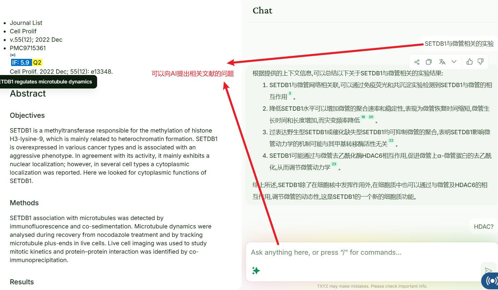

---
 
 

## SciSpace——AI阅读文献

* [SciSpace官网](https://typeset.io/ )

* 类似于Txyz.ai，用户也可以上传pdf就行文献阅读

* 其AI能理解文献里的**表格**和**公式**

* 其左边提供文献的**原始pdf版本**，可以一边读，一边问ai。对文字内容扩选即可提问。

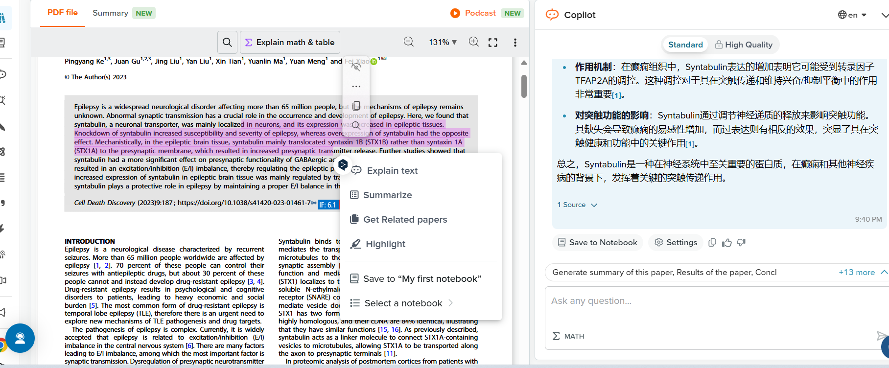

---
 
 

# 核酸数据库

## NCBI genebank——最常用gene检索工具

* [NCBI genebank官网](https://www.ncbi.nlm.nih.gov/genbank/)

* 非强强大！！！

***
 
 

## Ensemble——基因组数据库

* [Ensemble官网](https://www.ensembl.org/index.html?redirect=no)

* 与NCBI类似，但专注于基因组序列和注释。

* NCBI与Ensemble会进行每日**相互交换，实时汇总**。

* 我们在测序中，常发现这种类型的ID就是**Ensemble ID**

 

* Ensemble主要由几大功能构成

  * [**Ensembl**](https://www.ensembl.org/index.html) ：提供基因组浏览、基因注释及序列查询功能
  * [**BioMart**](https://www.ensembl.org/biomart/martview)：批量查询基因组注释信息,可以用于批量id的转换，如[RNA的ID转换](https://blog.csdn.net/lotusng/article/details/88399218)
  * [**VEP**](https://www.ensembl.org/info/docs/tools/vep/index.html)：注释 DNA 或 RNA 序列上的变异，上传变异文件（VCF 格式）进行注释
  * [**Ensembl REST API**](https://github.com/Ensembl) ：提供编程接口，便于通过代码访问 Ensembl 数据
  * [**Ensembl BLAST/BLAT**](https://useast.ensembl.org/Multi/Tools/Blast)：根据序列相似性在Ensembl 数据库中查找相关的基因或蛋白质

***
 
 

## GeneCards——人类基因综合数据库

* [GeneCards官网](https://www.genecards.org/)

* GeneCards给每个基因页面提供基因的基本信息，让研究人员可以快速了解目标基因的基本特征

* 搜索基因后，得到某个基因的信息，由以下板块组成

* GeneCards还提供以下工具
  
   * [**VarElect**](https://ve.genecards.org/?_gl=1*1i4ayuk*_ga*MTAzNDg1MjA1LjE2NzE2MTEzNzI.*_ga_XQREZYM5KY*MTczMzczMTk5MS4yNS4xLjE3MzM3MzUwNzUuMC4wLjA.*_gcl_au*OTE4MzE4OTA3LjE3MzM3MzE5OTE.#input) :允许用户上传基因变异数据，并分析这些变异可能对基因功能、蛋白质结构、功能通路等产生的影响
   
   * [**GeneAnalytics**](https://ga.genecards.org/#input) :用户可以输入或上传基因列表，进行**多个数据库的基因富集**（GO，KEGG，Reactome，OMIM等），[**详情点此**](#GeneAnalytics——多个数据库富集分析)
   
   * [**GeneALaCart**](https://genealacart.genecards.org/Query):用户可以上传基因列表，获取基因列表的**多维度信息注释**(涉及的通路，位置，功能，其他数据库的id……)

   * [**GenesLikeMe**](https://glm.genecards.org/#input)：用户设置不同的权重（结构域，表型，序列旁系同源物等等），找寻**相似的基因**
     

***
 

 

# 蛋白质数据库

## Uniprot——资源最广、信息最丰富的蛋白质数据库

* [Uniprot官网](https://www.uniprot.org/)

* [🌍一文读懂 UniProt 数据库](https://zhuanlan.zhihu.com/p/599641613)

* **Uniprot ID mapping**可用于Uniprot ID，蛋白ID转换 | [🌍ID mapping](https://www.uniprot.org/id-mapping)

* **Uniprot BLAST** 用于在 UniProt 数据库中查找与给定序列相似的蛋白质序列。它帮助研究者快速识别潜在的同源蛋白、功能注释和进化关系。| [🌍BLAST](https://www.uniprot.org/blast)

* **Uniprot Align**可用于对蛋白质序列进行序列比对的在线工具。它可以帮助研究人员比较多个蛋白质序列的相似性和差异性，从而揭示序列之间的进化关系、功能保守性以及重要结构特征，其使用**Clustal**进行[多序列比对](多序列比对(multiple-alignment)) | [🌍Align](https://www.uniprot.org/align)

* **Uniprot Peptide Search** 可用于通过已知的肽段序列（通常是短的氨基酸序列片段）在 UniProt 数据库中查找匹配的蛋白质记录。这个工具特别适用于质谱分析和肽段相关研究 | [🌍Peptide Search](https://www.uniprot.org/peptide-search)

 

* **Uniprot数据库组成**

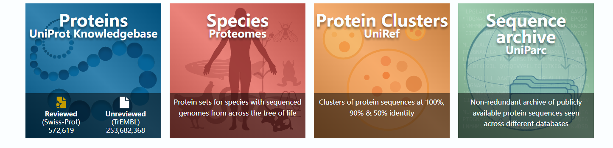

| **子数据库名称**              | **功能描述**                                                 | **特点**                                                     |
| ----------------------------- | ------------------------------------------------------------ | ------------------------------------------------------------ |
| **UniProtKB**                 | 提供蛋白质序列及其功能注释，包括实验验证数据和预测信息。     | 分为两个部分：UniProtKB/Swiss-Prot 和 UniProtKB/TrEMBL。     |
| **UniProtKB/Swiss-Prot**      | 高质量、人工注释的蛋白质序列数据库，包含详细功能注释、分类和序列校正。 | 数据准确、冗余度低，人工验证。                               |
| **UniProtKB/TrEMBL**          | 自动注释的蛋白质序列数据库，数据未经人工审查，适合高通量初步分析。 | 包含大量推测性信息，冗余度较高。                             |
| **UniParc**                   | 提供所有已知蛋白质序列的非冗余归档，用于追踪序列的历史变化。 | 非冗余，包含不同来源的所有蛋白质序列。                       |
| **UniRef**                    | 提供蛋白质序列的聚类信息，通过降低冗余度支持快速序列比对和分析。 | 分为 UniRef100、UniRef90 和 UniRef50，分别按不同序列相似性进行聚类。 |
| **Proteomes**                 | 提供全基因组蛋白质数据集，描述完整的蛋白质组。               | 覆盖完整的物种蛋白质组数据。                                 |
| **UniProt-GOA**               | 提供蛋白质与基因本体（Gene Ontology, GO）术语的关联数据。    | 支持功能注释和生物过程分析。                                 |
| **UniProt Metagenomics**      | 专注于元基因组蛋白质序列的数据库，用于研究环境样本中的微生物群体。 | 包含从环境样本中推测的序列和功能信息。                       |
| **UniProt Archive (UniParc)** | 提供蛋白质序列的完整历史记录，包括废弃序列和版本信息。       | 专注于序列变化的历史追踪。                                   |

 

* **冗余度**指的是数据中存在重复信息的程度。在生物信息学和数据库管理中，冗余度通常用于描述一个数据库中同一信息（如序列、记录）被多次存储的现象。

| **冗余度类型** | **优点**                                           | **缺点**                                   |
| -------------- | -------------------------------------------------- | ------------------------------------------ |
| **高冗余度**   | - 数据完整，保留所有重复记录，便于细节研究。       | - 数据量大，存储和计算成本高。             |
|                | - 适合精确匹配和稀有变异的全面分析。               | - 分析效率低，可能导致处理时间增加。       |
|                | - 可追踪多种来源的序列及注释。                     | - 容易产生信息冗杂，难以快速获取核心信息。 |
| **低冗余度**   | - 数据简洁，减少重复信息，便于快速分析和高效计算。 | - 可能会丢失一些序列的细节或来源信息。     |
|                | - 降低存储和处理成本，支持大规模数据研究。         | - 对特定的精确比对或溯源分析可能不够全面。 |
|                | - 提供代表性序列，适合进化分析和功能注释。         | - 可能需要结合高冗余数据补充额外信息。     |

***
 
 

 ## RCSB PDB——生物大分子结构数据库

* [RCSB PDB官网](https://www.rcsb.org/)

* [🌍入门PDB蛋白质数据库](https://www.bilibili.com/video/BV15v4y1M7QJ/?spm_id_from=888.80997.embed_other.whitelist&t=11.339674&bvid=BV15v4y1M7QJ&vd_source=951f1d2399bb1456eb6ac0a86e6efdd1)

* PDB即蛋白质数据库(Protein Data Bank)，是一个专门收录蛋白质、核酸等生物大分子三维结构的国际数据库。

* 数据库里的结构都是经过X射线、核磁、冷冻电镜等试验技术测得的

* 结构数据均为公有领域(PublicDomain)，无版权之忧

* 可下载PDB文件用于分子对接

***
 
 

## AlphaFold——AI预测蛋白质三维结构

* [AlphaFold官网](https://alphafold.ebi.ac.uk/)

* 存储由AlphaFold(AI)预测的蛋白质结构的数据库

* 可下载PDB文件用于分子对接

* 与**PDB**数据库的区别：

| **特性**         | **AlphaFold 数据库**                           | **PDB 数据库**                               |
| ---------------- | ---------------------------------------------- | -------------------------------------------- |
| **主要内容**     | 主要包括由人工智能预测的蛋白质三维结构         | 包含已知蛋白质的实验解析结构                 |
| **数据来源**     | AlphaFold 使用深度学习模型预测蛋白质结构       | PDB 中的结构来自实验数据，如 X 射线、NMR、EM |
| **精度**         | 高预测精度，尤其对于小型和中型蛋白质           | 高精度，依赖于实验技术的准确性               |
| **数据更新频率** | 定期更新，尤其是 AlphaFold 的新预测结果        | 更新较慢，通常依赖于实验数据的提交           |
| **结构类型**     | 仅包含蛋白质结构，且主要是已知蛋白质的预测模型 | 包括蛋白质、RNA、DNA 等的实验结构            |

***
 
 

## AlphaFold server——基于序列的结构与分子互作预测

* [AlphaFold server官网](https://alphafoldserver.com/)

* 在线输入特定的序列，服务器利用 AlphaFold 的深度学习模型预测其三维结构

* 在线输入不同的序列，能在线预测不同分子的互作

* 支持序列：**蛋白质，DNA，RNA，生物常见配体，离子**，

* 支持多种**翻译后修饰和化学修饰**添加

* 每天有20次使用机会

 

* 设置相同的随机**seed**，算法会生成相同的随机数序列，其预测结果会一致

* 设置不同**seed**运行同一模型，其主要目的是引入**随机性**（ 0 到 4,294,967,295 之间的任何整数）,运行模型的多个不同**seed**并对所有预测进行排名可以提高准确性

 

* 结果可以看到预测不同分子间的结构以及互作，其**颜色越蓝可信度越高**

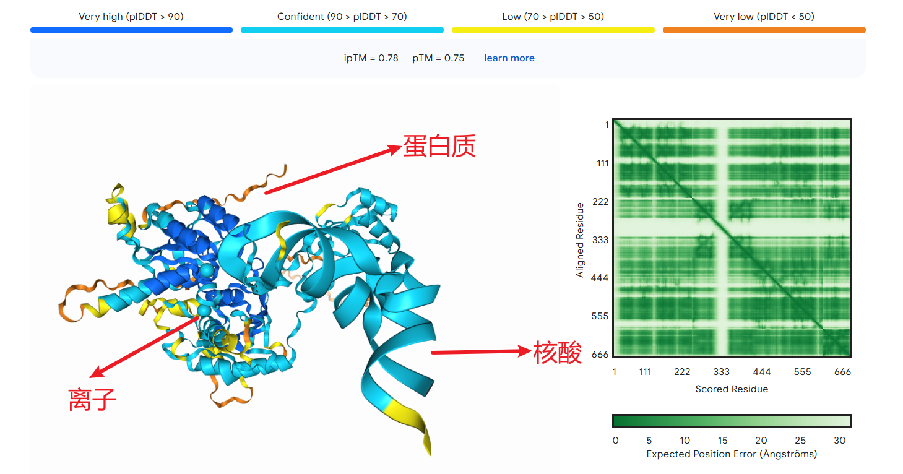

***
 
 

## Proteinatlas——人类蛋白质图谱数据库

* [Proteinatlas官网](https://www.proteinatlas.org/)

* 涵盖了人体主要组织、器官、细胞类型的蛋白质表达谱

| **模块名称**        | **描述**                                       |
| ------------------- | ---------------------------------------------- |
| **Tissue Atlas**    | 展示不同组织中的蛋白质表达模式                 |
| **Cell Atlas**      | 提供蛋白质在细胞及亚细胞区域的定位信息。       |
| **Pathology Atlas** | 关注蛋白质与疾病（尤其是癌症）的关联。         |
| **Blood Atlas**     | 专注于血浆中的蛋白质，探索血液相关生物标志物。 |
| **Brain Atlas**     | 专注神经系统蛋白质，分析其在大脑中的表达分布。 |
| **Metabolic Atlas** | 显示蛋白质在代谢途径中的分布和功能。           |

 

> 例如，搜索某个蛋白，可以得知在**不同器官，组织**在人类的表达量
>   
> 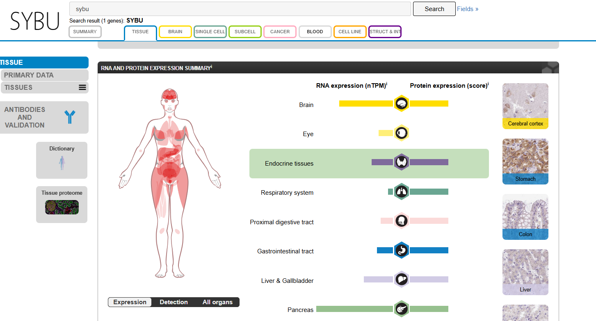

 

> 看到该蛋白在**不同细胞**的表达
>   
> 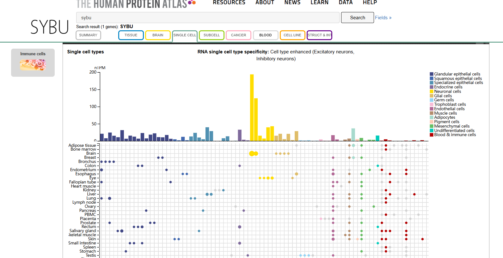

 

> 看到该蛋白在**细胞不同部位**的表达
>   
> 

 

> 看到该蛋白在**不同癌症**的表达
>   
> 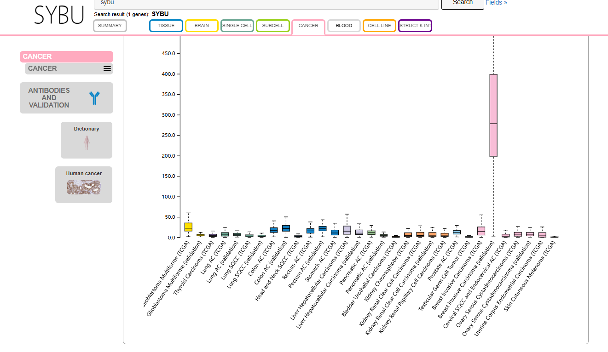

 

* 可以点击下图**红色**的地方，看到对应蛋白的**抗体**的**免疫荧光，免疫组化，wb结果**

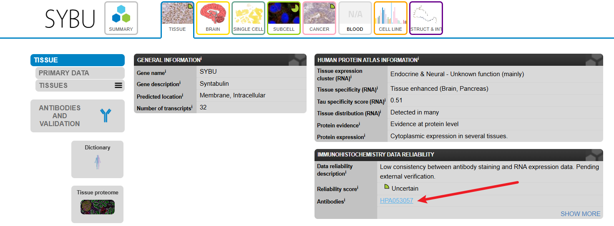

***
 
 

## InterPro——蛋白质结构域数据库

* [InterPro官网](https://www.ebi.ac.uk/interpro/)

* 其数据库根据蛋白质的结构域就行分类

* InterPro用于对蛋白质的结构域，功能位点就行预测

* InterPro在线工具可以通过3种形式提交数据：**蛋白质序列，蛋白ID或其他ID，结构域**

 

* 输入序列，可以预测序列的**结构域，功能位点，家族**

***
 
 

## CATH——蛋白质结构分类数据库

* [CATH官网](https://cathdb.info/)

* CATH 是一种基于蛋白质结构域的层次分类系统，其名称来源于四个分类层次：**Class**、**Architecture**、**Topology** 和 **Homologous Superfamily**。

| **层次**                                       | **描述**                                                     |
| ---------------------------------------------- | ------------------------------------------------------------ |
| **蛋白质的种类Class (C)**                      | 根据二级结构类型进行分类，分为全a型，全β型，a+B型，低二级结构型 |
| **蛋白质二级结构的构架Architecture (A)**       | 根据螺旋和折叠形成的超二级结构排列方式，不考虑他们之间的链接关系进行分类 |
| **蛋白质的拓扑结构Topology (T)**               | 基于二级结构的形状和二级结构间的联系分类                     |
| **蛋白质同源超家族Homologous Superfamily (H)** | 先通过序列比较然后在用结构比较确定的同源性分类               |

* 分类对象是 **中存储的那些已测定结构的蛋白质结构域**。**在2024年加入AlphaFold 数据库**

* 其有四大功能：**查询蛋白质三维结构，查询蛋白质的进化树，查询蛋白质功能，蛋白质保守位点**

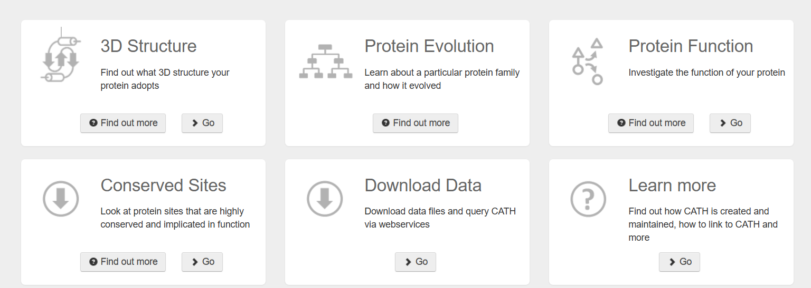

 

* 其支持3种形式就行搜索：**TEXT/ID，氨基酸序列，上传PDB文件**

 

* 其搜索结果为CATH命名的结构，**CATH_ID = C(类的编号).A(构架的编号).T(拓扑的编号).H(同源超家族的编号)**

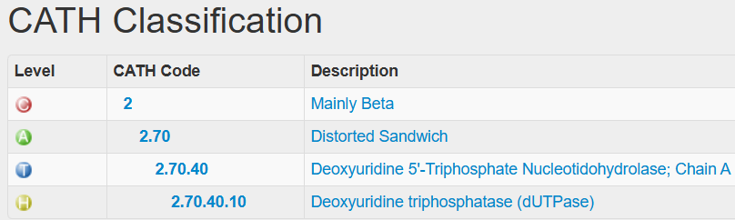

 

* 点进去会出现5个板块

 

>**Summary**
>  
>为所有拥有该同源超家族的结构域进行总结，分别为**GO（根据GO通路分类） Diversity，EC（根据反应类型分类） Diversity，Species Diversity**
>  
>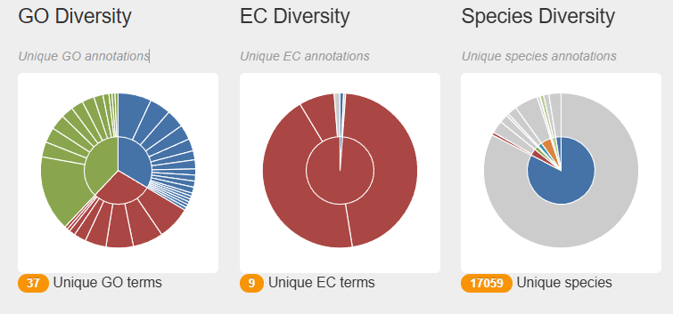 
>  
>以及该同源超家族的**序列及结构多样性**
>  
> 

 

>**Superfamily Superposition**为具有该**同源超家族的代表性的结构域的3D结构叠加在一起**，从图上能看出该结构的总体特征以及差异位置
>  
>

 

>**Classification/Domains**
>  
>**Classification**为该同源超家族每个层级的含义
>  
>
>  
>**Domains**为所有拥有该同源超家族的结构域，根据**序列相似度**进行分类
>  
>

 

>**Functional Families**为拥有该同源超家族的各种功能蛋白
>  
>

 

>**Structural Neighbourhood**为拥有该同源超家族的结构域相似度分布图 
>X轴表示序列相似性 
>Y轴表示结构相似性
>  
>

***
 
 

## SCOPe——蛋白质进化关系分类数据库

* [SCOPe官网](https://scop.berkeley.edu/)

* 与**CATH**类似，但**SCOPe**注重蛋白质进化关系进行分类，**CATH**注重蛋白质的结构进行分类

* 分类对象是 **中存储的那些已测定结构的蛋白质结构域**

* SCOPe分类基于四个层次:类(Class)、家族(Fold)、超家族(Superfamily)和折叠(Family)

| **层次**                | **描述**                                                |
| ----------------------- | ------------------------------------------------------- |
| **类(Class)**           | 根据蛋白质的二级结构组成（如 α 螺旋、β 折叠等）进行划分 |
| **家族(Fold)**          | 根据二级结构的排列方式和拓扑关系。                      |
| **超家族(Superfamily)** | 表示进化关系较远的同源蛋白                              |
| **折叠(Family)**        | 表示进化关系较近的同源蛋白                              |

* 只支持**文本、SCOPID、PDBID、UniProtlD**搜索，不支持**序列搜索**

***
 
 

## DSSP——获取蛋白质二级结构文件

* [DSSP官网](https://swift.cmbi.umcn.nl/gv/dssp/)  

* 输入PDB文件或PDB id获取**DSSP文件(包含蛋白质的二级结构文件)**

* **注意**：DSSP并不预测二级结构，而是根据二级结构的定义对已经测定三级结构的蛋白质的各个位置指认出是哪种二级结构。

 

* DSSP文件结构

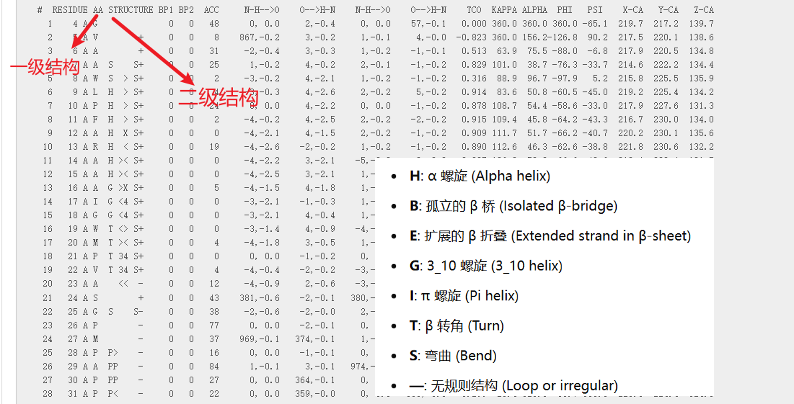

***
 
 

## PSIPRED——预测蛋白质的二级结构

* [PSIPRED官网](http://bioinf.cs.ucl.ac.uk/psipred/)

* [PSIPRED youtube教程](https://www.youtube.com/@psipreducl)

* 用户可以上传**氨基酸序列和PDB文件**进行二级结构预测

* 预测时间大概需要30分钟

***
 
 

## 蛋白质的翻译后修饰位点预测—DTU

* [**DTU**](https://services.healthtech.dtu.dk/)提供多种生物信息学工具，其中就有蛋白质的翻译后修饰位点(磷酸化，糖基化等)预测

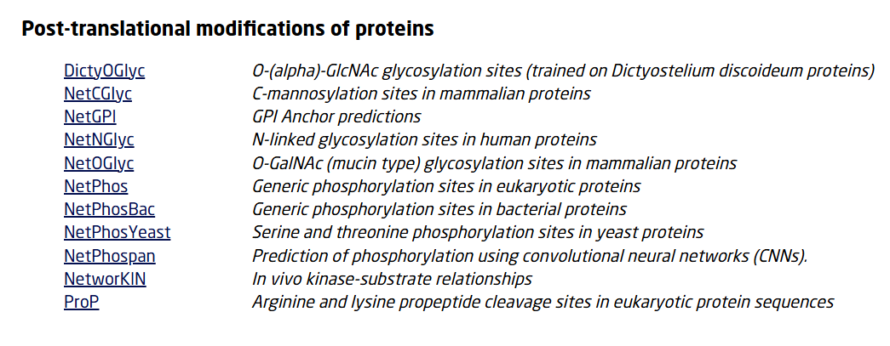

| 工具                                                         | 描述                                                         |
| ------------------------------------------------------------ | ------------------------------------------------------------ |
| [**DictyOGlyc**](https://services.healthtech.dtu.dk/services/DictyOGlyc-1.1/) | O-（α）-GlcNAc 糖基化位点（基于 Dictyostelium discoideum（变形虫）蛋白训练） |
| [**NetCGlyc**](https://services.healthtech.dtu.dk/services/NetCGlyc-1.0/) | 哺乳动物蛋白中的 C-甘露糖基化位点                            |
| [**NetGPI**](https://services.healthtech.dtu.dk/services/NetGPI-1.1) | GPI（细胞膜锚定结构）锚点预测                                |
| [**NetNGlyc**](https://services.healthtech.dtu.dk/services/NetNGlyc-1.0/) | 人类蛋白中的 N-链接糖基化位点                                |
| [**NetOGlyc**](https://services.healthtech.dtu.dk/services/NetOGlyc-4.0/) | 哺乳动物蛋白中的 O-GalNAc（粘蛋白型）糖基化位点              |
| [**NetPhos**](https://services.healthtech.dtu.dk/services/NetPhos-3.1/) | 真核蛋白中的磷酸化位点                                       |
| [**NetPhosBac**](https://services.healthtech.dtu.dk/services/NetPhosBac-1.0/) | 细菌蛋白中的磷酸化位点                                       |
| [**NetPhosYeast**](https://services.healthtech.dtu.dk/services/NetPhosYeast-1.0/) | 酵母蛋白中的丝氨酸和苏氨酸磷酸化位点                         |
| [**NetPhospan**](https://services.healthtech.dtu.dk/services/NetPhospan-1.0/) | 利用卷积神经网络（CNNs）预测磷酸化位点                       |
| [**NetworKIN**](https://networkin.info/)                     | NetworKIN 体内激酶-底物关系                                  |
| [**ProP**](https://services.healthtech.dtu.dk/services/ProP-1.0/) | 真核蛋白序列中的精氨酸和赖氨酸前肽切割位点                   |

* [**DTU**](https://services.healthtech.dtu.dk/)网站除了翻译后修饰，还提供其他类型大量的生物学工具，大家都可以点开试一下

***
 
 

# 标识符Identifier转换工具

* **标识符（Identifier）** ： 是用于唯一标识某个生物学实体（如基因、蛋白质、物种、序列等）的一串字符或编号。标识符在数据库和工具之间传递数据时，起到了非常重要的作用，因为它能够确保不同的系统和数据库能够一致地引用同一对象。如：nsembl Gene ID（如 ENSG00000141510）

 

* [g:Convert](https://biit.cs.ut.ee/gprofiler/convert) 能够在各种基因、蛋白质、微阵列探针和许多其他类型的命名空间。其为 60 多个物种提供至少 40 种类型的 **标识符**的转换。

* [biotools](https://biotools.fr/)提供多种生物信息学工具，其中支持多种生物（人，小鼠，果蝇，鸡）的**标识符**转换。    

* [bioDBnet](https://biodbnet.abcc.ncifcrf.gov/)提供多种**标识符**生物学学工具

 

| 工具名称                                                     | 功能说明                                                     |
| ------------------------------------------------------------ | ------------------------------------------------------------ |
| [**db2db**](https://biodbnet.abcc.ncifcrf.gov/db/db2db.php)  | 标识符的转换                                                 |
| [**dbWalk**](https://biodbnet.abcc.ncifcrf.gov/db/dbWalk.php) | 查看数据库之间的标识符的转换和数据流动。例如，在不同数据库之间进行标识符的转换时，dbWalk 让你能够清晰地看到数据是如何一步步流动和转化的。 |
| [**dbReport**](https://biodbnet.abcc.ncifcrf.gov/db/dbReport.php) | 获取并报告与特定标识符相关的所有信息。                       |
| [**dbFind**](https://biodbnet.abcc.ncifcrf.gov/db/dbFind.php) | 查找标识符的类型并将其转换为选定的目标数据库标识符。         |
| [**dbOrtho**](https://biodbnet.abcc.ncifcrf.gov/db/dbOrtho.php) | 将一个物种的标识符转换为另一个物种的同源标识符。             |
| [**dbAnnot**](https://biodbnet.abcc.ncifcrf.gov/db/dbAnnot.php) | 提供各种生物学标识符的注释信息。                             |
| [**dbOrg**](https://biodbnet.abcc.ncifcrf.gov/db/dbOrg.php)  | 提供可下载的包含物种标识符转换数据的文件。                   |
| [**orgTaxon**](https://biodbnet.abcc.ncifcrf.gov/tools/orgTaxon.php) | 查找某个物种的 **taxon ID**（分类单元ID）。                  |
| [**goTree**](https://biodbnet.abcc.ncifcrf.gov/tools/goTree.php) | 查看某个 **GO** 术语的父级信息，帮助理解其层次结构。         |
| [**chrView**](https://biodbnet.abcc.ncifcrf.gov/tools/chrView.php) | 在染色体上可视化数据，查看基因的具体位置。                   |
| [**bioTaxon**](https://biodbnet.abcc.ncifcrf.gov/tools/bioText.php) | 根据搜索词查找与物种相关的基因、蛋白质或 **GO** 术语。       |

***
 
 

# 富集分析相关网站

## STRING——蛋白质互作数据库

* [STRING官网](https://string-db.org/cgi/input?sessionId=bln2w9LAErVv&input_page_active_form=multiple_identifiers)

* 当我们想知道一个蛋白与什么蛋白发生互作，或在测序过程中得到一系列差异蛋白，想了解他们的相互作用，就可以使用**STRING**

* STRING除了可以看蛋白互作，还可以进行蛋白的**富集分析**

* STRING由以下功能组成

 

* 互作网络如下图显示，不同颜色的线代表不同的证据，点击线条可以查看证据的来源

 

* 可以输出TSV格式，在[**Cytoscape**](https://cytoscape.org/)进一步分析

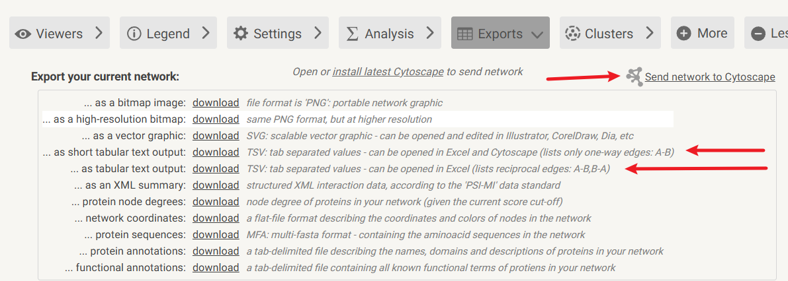

***
 
 

## GO
* [GO官网](https://www.geneontology.org/)

* 其拥有**最多**的基因集，了解基因参与的具体生物学活动

* 不能提供具体的分子网络关系，只是描述功能。

* 支持多个物种

* **频繁跟新**，来源**文献人工注释、实验数据和预测数据相结合**

* 其数据库由三大模块构成：
    * **分子功能（Molecular Function）**
    * **生物过程（Biological Process）**
    * **细胞组成（Cellular Component）**

 

* GO官网还有以下的[**工具**](https://www.geneontology.org/docs/tools-overview/)：
  * [**GO-CAM**](https://geneontology.cloud/home)：是GO的扩展模型，提供了基因的在基因集的通路网络，以及基因集之间的关系 
    用户可以访问[**Noctua**](http://noctua.geneontology.org/workbench/noctua-landing-page/)平台创建自己的的 GO-CAM 模型
     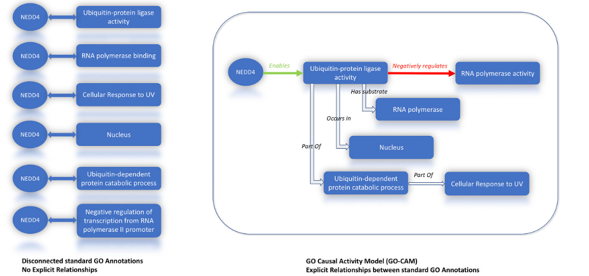
     

   
  
  * [**AmiGO2**](https://amigo.geneontology.org/amigo/landing)：限制特定参数，搜索目标基因相关的所有GO基因集

    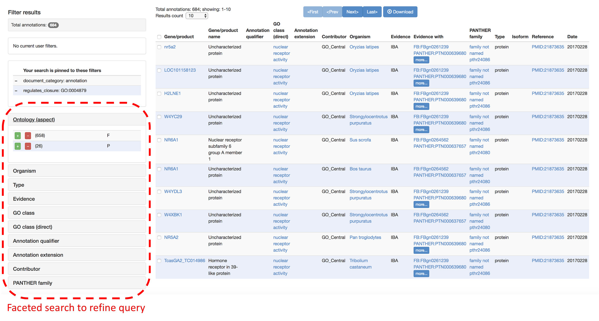

    查看通路之间的相互关系[**矩阵**](https://amigo.geneontology.org/matrix)

    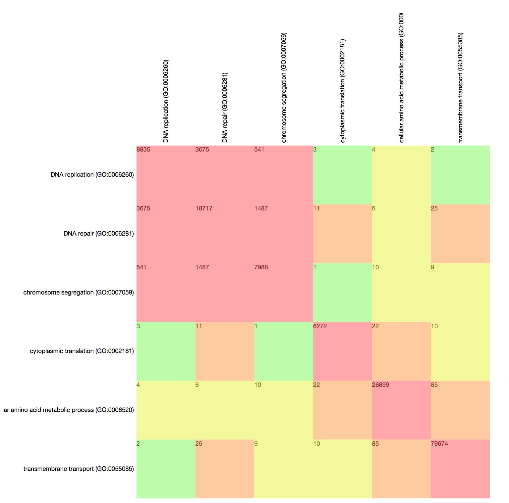

    以及查看通路的[**交互树**](https://amigo.geneontology.org/amigo/dd_browse)

    
  
   
  
  * [**GO Ribbon**](https://www.geneontology.org/ribbon.html):用于快速查看某个基因涉及的GO基因集

    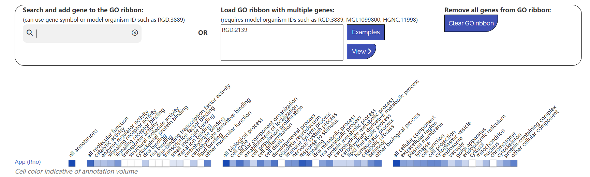
***
 
 

## KEGG
* [kegg官网](https://www.genome.jp/kegg/)

* 基因集相比GO数量会少很多，更侧重于基因在生物系统中的通路的相互作用和调控

* 提供图形化的通路图，展示基因，代谢物间的关系。

* **数据更新速度慢**，基于手动注释，通路**可信度非常高**

* 支持多个物种

* 其数据库由七大模块构成：
    * **Metabolism（代谢）**
    * **Genetic Information Processing（遗传信息处理）**
    * **Environmental Information Processing（环境信息处理）**
    * **Cellular Processes（细胞过程）**
    * **Organismal Systems（有机体系统）**
    * **Human Diseases（人类疾病）**
    * **Drug Development（药物开发）**

 

* 提供[**KOALA**](https://www.kegg.jp/blastkoala/)工具， 用户上传DNA或氨基酸序列与 KEGG 数据库中的参考序列比对，找到最相似的KEGG Ortholog (KO) 注释

***
 
 

## Reactome

* [Reactome官网](https://reactome.org/)

* 基因集相比GO数量会少很多

* 数据更新速度慢，基于手动注释，通路**可信度非常高**

* 以人类为主，支持多种模式生物（通过同源通路推测）

* [**提供交互式通路浏览器**](https://reactome.org/PathwayBrowser/#TOOL=AT)，由以下功能组成

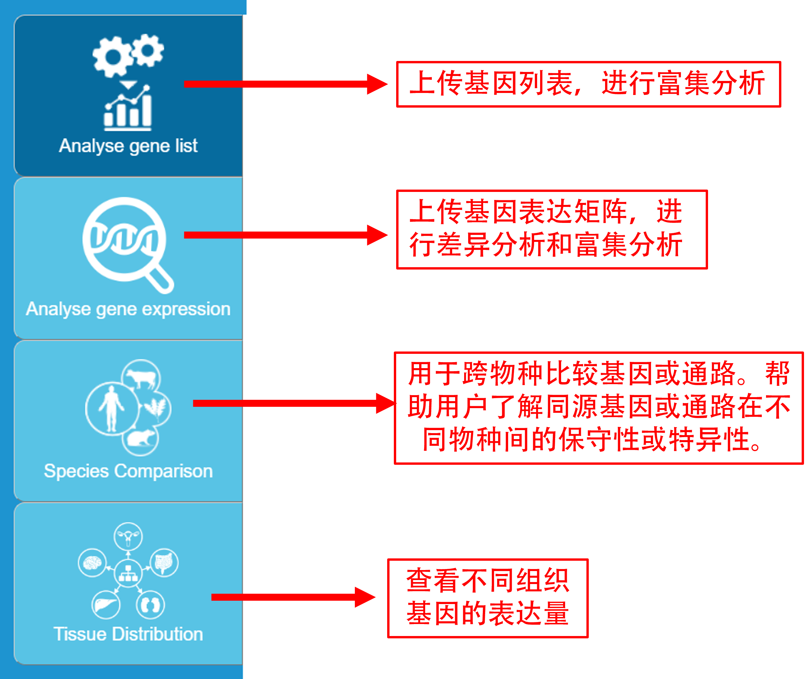

 

* 其富集分析能自动生成**pdf报告**，生成富集分析的通路简介，以及富集的基因

***
 
 

## GeneAnalytics——多个数据库富集分析

* [GeneAnalytics官网](https://ga.genecards.org/#input)

* **GeneAnalytic**为**GeneCards**下的一个工具，用户可以输入或上传基因列表，进行多个数据库（GO，KEGG，Reactome，OMIM等）的基因富集，并进行总体的得分排名。

* 只支持物种：**人和小鼠**，只支持输入**symbol id**

* 其富集的输出由以下版块组成

***
 
 

## Enrichr——多个数据库富集分析

* [Enrichr官网](https://maayanlab.cloud/Enrichr/)

* 类似于**GeneAnalytics**对多个数据集进行富集分析，但数据库类型比**GeneAnalytics**范围更大

* 只支持输入**symbol id**

* 没有**物种选择**，可能会增加背景干扰因素

* 除了网上的数据库，还有**社区用户贡献的基因集**，而且自己本身也可以上传基因集供社区用户使用

 

* 其富集的输出由以下版块组成

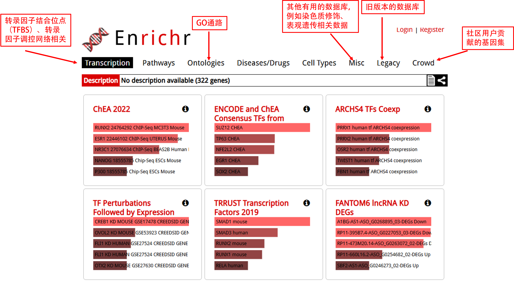

***
 
 

## GSEA——推断通路上下调

* [GSEA官网](https://www.gsea-msigdb.org/gsea/index.jsp)

* GSEA是一种算法：其不需要对单个基因进行阈值过滤（如差异显著性），而是直接基于所有基因的排序进行分析。通过基因的Fold Change分配权重来判断通路上下游。

 

* 需要下载[GSEA软件](https://www.gsea-msigdb.org/gsea/downloads.jsp) | [一文掌握GSEA通路富集分析，超详细教程](https://blog.csdn.net/qazplm12_3/article/details/122076674)

* GSEA下的的**MSigDB**包含多种数据集，**MSigDB**数据集只支持人和小鼠

**人类**
| **类别** | **描述**                                                     |
| -------- | ------------------------------------------------------------ |
| **C1**   | Positional Gene Sets：基因按染色体位置分组，如染色体臂或染色体区域 |
| **C2**   | Curated Gene Sets：从公开数据库（如 KEGG、Reactome）和文献中收集的基因集 |
| **C3**   | Regulatory Motifs：调控靶基因集（如转录因子结合位点或 microRNA 靶点） |
| **C4**   | Computational Gene Sets：通过挖掘大量面向癌症的表达数据来定义的计算基因集 |
| **C5**   | Ontology Gene Sets：GO 基因集                                |
| **C6**   | Oncogenic Signature Gene Sets：致癌特征基因集                |
| **C7**   | Immunologic Signatures：免疫相关基因集                       |
| **C8**   | Cell Type Signatures：细胞类型基因集，适合单细胞测序         |
| **H**    | Hallmark Gene Sets：核心基因集，捕捉基本生物学过程和信号通路 |

**小鼠**
| **类别** | **描述**                                                     |
| -------- | ------------------------------------------------------------ |
| **M1**   | Positional Gene Sets：基因按染色体位置分组，如染色体臂或染色体区域 |
| **M2**   | Curated Gene Sets：从公开数据库（如 KEGG、Reactome）和文献中收集的基因集 |
| **M3**   | Regulatory Motifs：调控靶基因集（如转录因子结合位点或 microRNA 靶点） |
| **M5**   | Ontology Gene Sets：GO 基因集                                |
| **M8**   | Cell Type Signatures：细胞类型基因集，适合单细胞测序         |
| **MH**   | Hallmark Gene Sets：核心基因集，捕捉基本生物学过程和信号通路 |

***
 
 

## clusterProfiler——最强富集分析工具

* [clusterProfiler说明书](https://yulab-smu.top/biomedical-knowledge-mining-book/)

* 需要一定的R语言基础

* 由国内的y叔所开发，其还提供[其他非常强大的R包](https://yulab-smu.top/contribution-knowledge-mining/)

* 支持多种数据库富集分析(**GO,KEGG,Reactome等等**)，还支持**GSEA算法对基因集进行GSEA分析**

* 简化了画图代码，画富集分析图非常方便与简单。能画多种富集分析图，多维度查看你的数据集。

***
 
 

# 序列比较相关网站

## 如何评估序列相似？

* 序列相似有2个指标：**一致度** ，**相似度**

* **一致度**: 如采两个序列(蛋白质或核酸)长度相同，那么它们的一致度定义为他们对应位置上**相同**的残基占总长度的百分数。

* **相似度**: 如果两个序列(蛋白质或核酸)长度相同，那么它们的相似度定义为他们对应位置上**相似与相同**的残基的数目占总长度的百分数。

* **可为相识与相同的残基？**：
  **替换记分矩阵(Substitution Matrix)** ，反映残基之间相互替换率的替换记分矩阵，它描述了残基两两相似的量化关系。分为DNA替换记分矩阵和蛋白质替换记分矩阵。

  

***
 
 

## 常见的DNA替换记分矩阵

* **等价矩阵(unitarymatrix)** :最简单的替换计分矩阵，其中，相同的碱基之间匹配得分为1，而不同碱基间的替换得分为0。
    由于这种矩阵不含有碱基的物理化学信息，而且不区别对待不同的替换，因此在实际研究中运用较少。

  

 

* **转换-颠换矩阵(transition-transversionmatrix)** :碱基的替换发生在嘧啶之间或嘌呤之间，则称为**转换**；而如果发生在嘧啶和嘌呤之间，则称为**颠换**

   在进化过程中，转换发生的频率远比颠换高。为了反映这一情况，通常该矩阵中**转换**的得分为-1，而**颠换**的得分为-5
  
  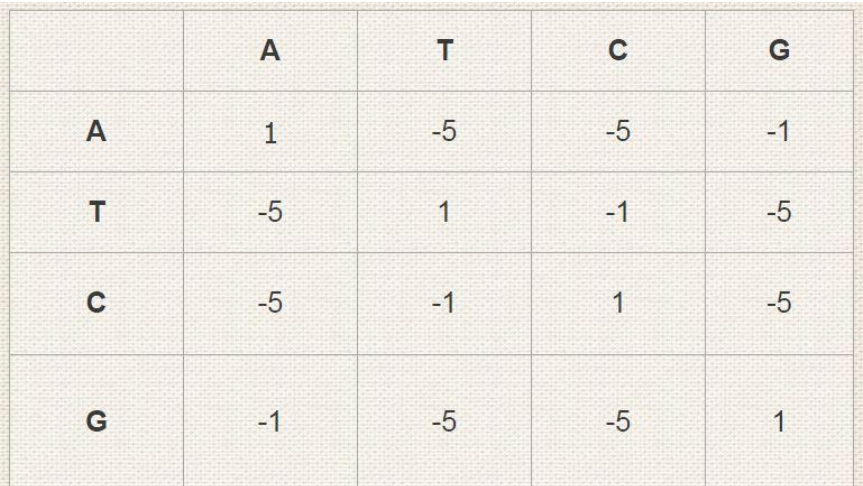

 

* **BLAST矩阵** :经过在研究过程中的大量实际对比发现，如果令被比对的两个核苷酸相同时得分为+5，反之为-4，则比对效果较好，这就是被广泛使用的BLAST矩阵。

  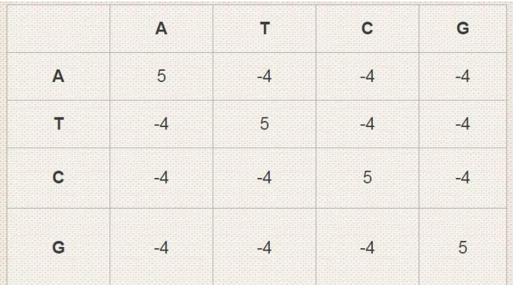

***
 
 

## 常见的蛋白替换记分矩阵

* **等价矩阵(unitary matrix)** ：蛋白质等价矩阵和DNA等价矩阵原理相同，相同氨基酸的匹配得分为1，不同氨基酸的替换得分为0。实际研究中运用较少  

* **PAM矩阵** ：PAM矩阵是目前应用最广泛的计分方法之一，其基于进化原理。如果两种氨基酸替换频繁，说明自然界容易接受这种替换，那么这对氨基酸的替换得分就应该高。  **PAM-1**矩阵是进化产生的每一百个氨基酸发生一个突变的量值，**PAM-n**，即发生了n次突变  我们需要根据要比较的序列之间的亲缘关系远近来选择适合的PAM矩阵
    * 如果序列亲缘关系远，即序列间会有很多突变，就选择PAM-N中N数值较大的矩阵
    * 如果亲缘关系近，即序列间的突变较少，就选择PAM-N中N数值较小的矩阵。

 

* **BLOSUM矩阵(blocks substitution matrix)**
  BLOSUM矩阵，也的是，有许多种矩阵带有编号。  
  如**BLOSUM-90**，代表该矩阵是由一致度大于等于90%的序列计算而来的。  
  BLOSUM都是通过对大量符合特定要求的序列计算而来的。
  * BLOSUM后编号较小的矩阵适合比较序列相似度低的序列（即亲缘关系远的序列）
  * BLOSUM后编号较大的矩阵适合比较序列相似度高的序列（即亲缘关系近的序列）

 

* **PAM与BLOSUM**

 

* 不知道亲缘关系远近或懵了，用**BLOSUM-62**

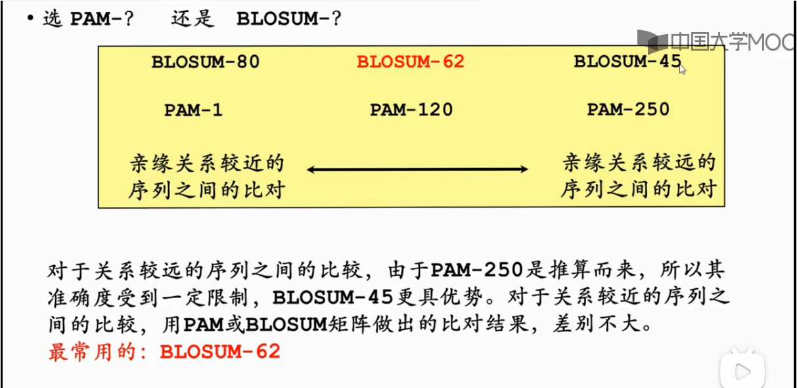

 

* **遗传密码矩阵GCM** :通过计算一个氨基酸残基转变到另一个氨基酸残基所需的密码子中碱基变化数目而得到的，矩阵元素的值对应付出于代价。

* **疏水矩阵** :根据氨基酸残基替换前后疏水性的变化而得到得分矩阵。若一次氨基酸替换疏水特性不发生太大的变化，则这种替换得分高，否则替换得分低

***
 
 

## 双序列比较——打点法

* **打点法** ：两个序列打点判断是否相似

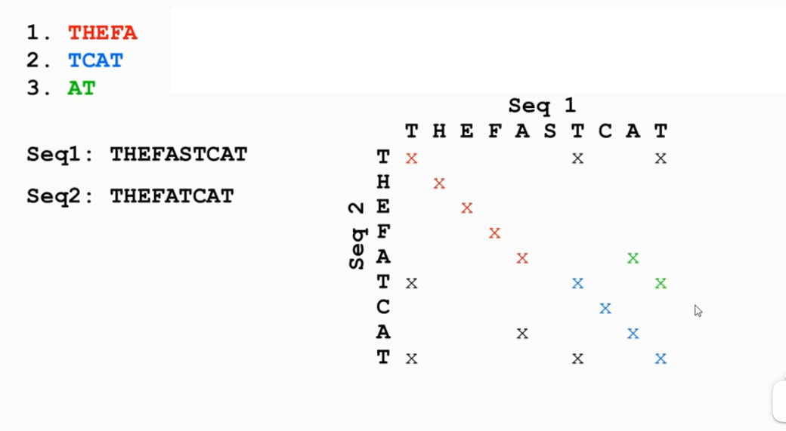

* 在打点矩阵中，**连续的对角线及对角线的平行线**代表两条序列中相同的区域。如图中的红线，蓝线，绿线

* 最后，我们放眼全局，**红色的线和蓝色的线加起来基本上构成了一条主对角线**。由此我们可以得出结论:序列1和序列2是比较相似的两条序列

 
 

* 可以用一条序列自己对自己打点，寻找串联重复序列。这样的打点矩阵必然是对称的，并且有一条主对角线。

* 与**主对角线平行的短平行线**所对应的序列片段就是重复的部分。

 
 

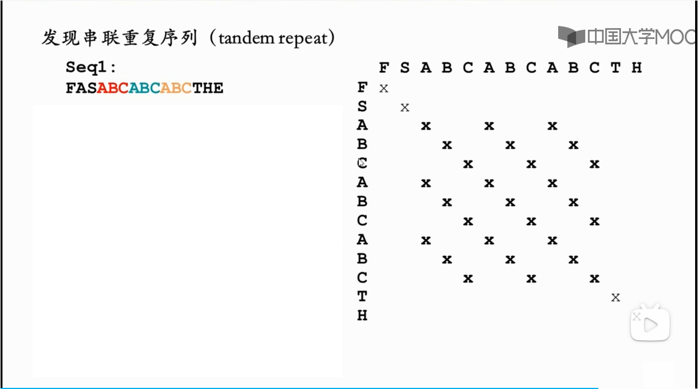

* 用这种方法我们还可以快捷的发现**短串联重复序列和重复次数**

* **短串联重复序列(short tandemrepeat,STR)** ：也叫做微卫星DNA.是一类广泛存在于真核生物基因组中的DNA串联重复序列。

* **STR**由2-6bp的核心序列组成，重复次数通常在15-30次。

* **STR**具有高度多态性即存在重复次数的个体间差异，而且这种差异在基因遗传过程中一般遵循孟德尔共显性遗传规律，所以它被广泛用于法医学个体识别、亲子鉴定等领域。

***
 
 

## 打点法网站
* [**Dotlet**官网](https://dotlet.vital-it.ch/)

***
 
 

## 双序列比对alignment

* **序列比对法(alignment)** :两条序列的比对就是把 s 和 t 这两个字符串上下排列起来，在某些位置插入空格(gap)。

  然后依次比较它们在每一个位置上字符的匹配情况

  匹配的好，这个位置就会得高分

  匹配的不好，看看能不能左右错一错，或填上个空位，让附近的位置更好的匹配在一起，从而**使所有位置的得分之和尽可能的高**。

  说白了，就是通过插入空位，让上下两行中尽可能多的一致的和相似的字符对在一起

  需要使用专门的**序列比对算法**。分为**全局比对与局部比对**

 

***
 
 

### 全局比对法

* **Needleman-Wunsch算法**

* 比较复杂，建议看视频：[视频1](https://www.bilibili.com/video/BV13t411372E?spm_id_from=333.788.videopod.episodes&vd_source=951f1d2399bb1456eb6ac0a86e6efdd1&p=37)，[视频2](https://www.bilibili.com/video/BV1qM4y1D7ND?spm_id_from=333.788.videopod.sections&vd_source=951f1d2399bb1456eb6ac0a86e6efdd1)

输入选项有：**序列p和序列q，替换记分矩阵，空位罚分（下图gap=-5）**

其中箭头代表**追溯箭头**代表其最大值从那个方格来。

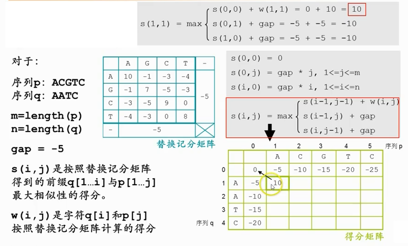

 
 

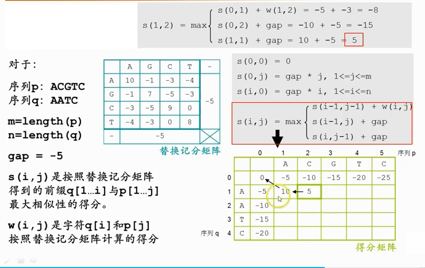

 
 

***
 
 

### 局部比对法

* **Smith-Waterman算法**

* 比较复杂，建议看视频：[视频1](https://www.bilibili.com/video/BV13t411372E?spm_id_from=333.788.videopod.episodes&vd_source=951f1d2399bb1456eb6ac0a86e6efdd1&p=38)

* 与全局比对的区别在于，**其s(i,j)最大值多了个0**

 

* **其得分为矩阵中最大的值：16**

* 追溯箭头不是从右下角到左下角，**而是从刚刚找到的最大值开始追溯到没有箭头为止**

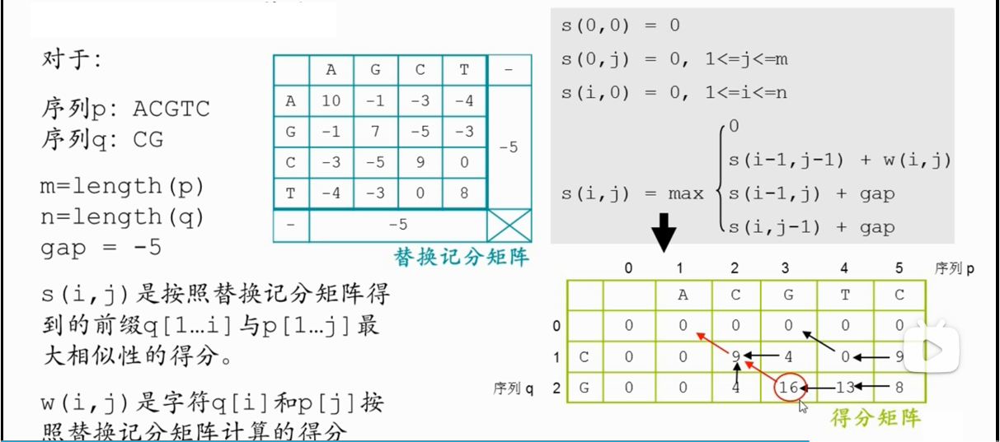

***
 
 

### 一致度(identity)和相似度(similarity)

***
 
 

## 双序列比对alignment网站

* [**EBML_PSA**](https://www.ebi.ac.uk/jdispatcher/psa)

* 当设置**GAP OPEN**罚分多，**GAP EXTEND**罚分少时，称之为**集中空位**，说明打开一个gap付出代价比较多，延长gap代价少，gap比较集中。

* 当设置**GAP OPEN**罚分少，**GAP EXTEND**罚分多时，称之为**分散空位**，说明打开一个gap付出代价比较少，延长gap代价大，gap比较分散。

* 所以需要根据不同的生物学背景，来选择**GAP OPEN与AP EXTEND**

 

* 在**局部比对中**只有中间黑色的相似的部分出现在比对结果中了，两头红色的不相似的部分被忽略掉了。

  也就是只返回了**局部最相似,得分最高的片段的比对结果**。

 

* 除了一长一短两条序列适合做局部比对，有的时候**两条差不多长的序列也可以做局部比对**，**以找出它们最相似的局部片段**。 

  为了让相似的部分突出出来，把**GAP都调最大**，**GAP OPEN**调到10，**GAP EXTEND**调到5。

***

 
 

## 多序列比较——BLAST

* 使用序列比对法(alignment)去比对数据库的每一条序列，耗时比较长。所以使用**BLAST算法**快速从数据库准确找到相似的序列

 

* **BLAST算法(Basic Local Alignment Search Tool)** 采取seeding-and-extending方法。 首先找到query序列和subject序列间匹配的seed， 然后沿种子向两边延伸，产生High Scoring Segement Pairs (HSPs)， 然后在这些特定区域运用Simith-waterman 算法，最后评估比对的identify。

***
 

* **BLAST的主要步骤**

  * **分词(Creat a word list)**
    >BLAST首先将输入的序列分解成固定长度的小片段。   
    >**类比**：假设你的句子是“GATTACA”，BLAST会拆成这些小片段："GAT", "ATT", "TAC", "ACA"  

  * **种子匹配（Seed Matching）**
    >BLAST会把这些小片段和数据库中的索引(index)快速匹配，找到所有完全相同的词（**种子匹配**）。    
    >**类比**：这就像在图书馆中快速找到包含“GAT”或“ATT”等关键词的书。

  * **扩展匹配（Extension）**
    >一旦找到一个匹配的小片段，BLAST会从这个片段出发，尝试向两侧扩展匹配，计算相似性得分，直到得分下降到一定程度为止（**得分下降阈值**）。   
    >**类比**：如果发现一本书有一句话和你的句子的一部分相同，就继续往前后查找，看整段话是否更相似。

  * **评分系统（Scoring System）**
    >BLAST会对每次比对结果进行打分  

  * **返回最佳结果（High-Scoring Pair, HSP）**
    >BLAST会对所有比对结果进行排序，返回得分最高的片段（**HSP**）。这些结果通常用 **E-value** 衡量（值越小，匹配越可靠）。

    >**E-value**表示在给定数据库规模下，随机出现某个比对得分或更高得分的**预期次数**(其不为概率，应大于1)。其公式如下：

    >$$
    >E = K \cdot m \cdot n \cdot e^{-\lambda S}
    >$$

    >$ E $：期望值，表示随机比对中出现得分不低于 $ S $ 的次数。 
    >$ K $：与搜索空间维度及特性相关的常数。 
    >$ m $：查询序列（query sequence）的长度。 
    >$ n $：数据库的大小。 
    >$ lambda $：与比对得分系统相关的比例参数。 
    >$ S $：比对的原始得分（根据得分矩阵计算）。 
    >$ e $：自然对数。

  * **序列比对(alignment)得出identify(一致度)**
   >BLAST会对所有（**HSP**)片段与query序列进行序列比对(alignment), 得出**identify(一致度)**

* 具体参考[轻松理解BLAST搜索原理](https://blog.csdn.net/weixin_46432623/article/details/105520286)  [视频1](https://www.bilibili.com/video/BV1oY411p7jV/?spm_id_from=333.337.search-card.all.click&vd_source=951f1d2399bb1456eb6ac0a86e6efdd1)

***
 

* **BLAST按功能分类**，[详见](https://www.bilibili.com/video/BV13t411372E?spm_id_from=333.788.videopod.episodes&vd_source=951f1d2399bb1456eb6ac0a86e6efdd1&p=45)

| **工具**    | **功能描述**                                                 | **应用场景示例**                                             |
| ----------- | ------------------------------------------------------------ | ------------------------------------------------------------ |
| **blastn**  | 将给定的核酸序列与核酸数据库中的序列进行比对。               | 比对新测序的 DNA 序列，找到可能的同源基因或物种来源。        |
| **blastp**  | 使用蛋白质序列与蛋白质数据库中的序列进行比对。               | 对一个未知蛋白质的氨基酸序列进行比对，推测其功能或同源蛋白。 |
| **blastx**  | 将给定的核酸序列按**六种阅读框架**翻译成蛋白质序列，与蛋白质数据库中的序列进行比对。 | 分析一个新的转录本序列可能编码的蛋白质功能。                 |
| **tblastn** | 用蛋白质序列搜索核酸序列数据库，核酸序列数据库按**六种阅读框**架翻译成蛋白质序列后再比对。 | 找到数据库基因组中可能没有注释的新的编码区域。               |
| **tblastx** | 将核酸序列按**六种阅读框架**翻译成蛋白质序列后，比对另一个按**六种阅读框架**翻译的核酸序列数据库。 | 物种间的转录本序列比较，找到潜在的非编码区的功能或编码序列的同源关系。 |

  * **六种阅读框架**：将输入的核酸序列按 6 种可能的阅读框翻译成蛋白质序列：  
    > 正链的 3 个阅读框因为不知道起始密码子，每个阅读框从不同的起始位置（1、2 或 3 碱基）开始读取三联密码子翻译为氨基酸 
    > 负链的 3 个阅读框:有可能从这条链互补链翻译。

 

***
 
 

* **BLAST按算法分类**

  * **标准BLAST**

  * **PSI-BLAST(Position-Specific Iterated)**：基于标准 BLAST，利用初次比对的结果构建**位置特异性评分矩阵（PSSM）**，进行多次迭代比对，直到结果不再有显著变化时停止。

    用于寻找远缘的同源序列或者找蛋白家族新的成员。

    **位置特异性评分矩阵（PSSM）**： 是一种用于描述生物序列中每个位置上不同字符（如氨基酸或碱基）的频率和“权重”的矩阵

    在**PSI-BLAST**流程中，第一轮搜索会使用**标准的blast**，然后你需要选择第一轮搜索到的序列都将用来创建**PSSM**（默认使用全部序列创建**PSSM**）来进行**PSI-BLAST**    

    >假设 A 的朋 友只有 B，B 朋友除 A 外还有 C。
    >
    >如果输入序列的第一个位置是 A，那么在第一轮没有 PSSM 辅助的情况下，只有第一个位置是 A 或 B 的序列被找到了。它们是图 1-A 中所示的四条序列。
    >
    >根据这四条序列创建的 PSSM(图 1-B)得知，第一个位置可以是 A，也可以是 B，那么 在第二轮搜索中，除了 A 的朋友 B 之外，B 的朋友 C 也可以出现在第一个位置了。这样如此反复，我们就可以找到朋友的朋友了。
    
    >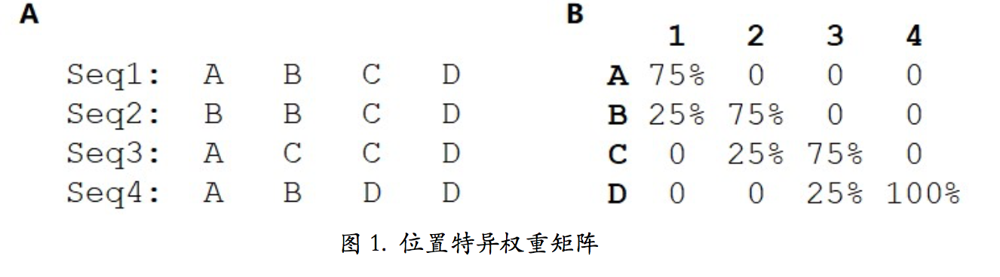
    
     
    
  * **PHI-BLAST(Pattern-Hit Initiated)** ：输入序列相似的并符合某种特定**模式(pattern)**, **模式(pattern)** 是对特征的描述, 特定模式可通过正则表达式来表述(正则表达式就是这句话的一个简约的规范性字符书写法)
  
  > 比如:发生 N 糖基化位点的序列都符合这样一个特定的模式：发生糖基化的天冬酰胺，后面一定紧跟一个脯氨酸以外的氨基酸，再紧跟丝氨酸或者苏氨酸，再紧跟一个脯氨酸以外的氨基酸
    >
    > 发生 N 糖基化位点的序列符合的特定模式翻译成正则表达式为 **N{P}[ST]{P}** 。
    >
    > 其中，**N**是天冬酰胺，**P**是脯氨酸，**S**是丝氨酸，**T**是苏氨酸 
    > **{}** 代表除大括号里的氨基酸以外的任意氨基酸， **[ ]** 代表中括号中的任意一个氨基酸
    
     
  
  > 在正则表达式中，除了以上，还有：**x** 代表任意字母， **(3,7)** 代表 3 到 7 个某字符。
    >
    > **{L}GEx[GAS][LIVM]x(3,7)**
    >
    > 除**L**以外的任意一个字母，紧接**G**，再紧接**E**，再接一个任意字符，之后是**GAS**中的任意一个，再接**LIVM**中的任意一个，最后再接 3 到 7 个任意字符
  
 
  

***
 
 

## BLAST网站
* 其实各大数据库都支持跨数据库进行Blast, 喜欢用那个就用哪个。 

* [**NCBI BLAST**](https://blast.ncbi.nlm.nih.gov/Blast.cgi)

* [**EBMI_BLAST/SSEARCH/FASTA**](https://www.ebi.ac.uk/jdispatcher/sss)

  **SSEARCH** :它有点儿慢，但是比 BLAST 更准确

  **FASTA** :它也是有点儿慢，但是对于 DNA 序列的比较比 BLAST 更准确

* [**Uniprot BLAST**](https://www.uniprot.org/blast)

* [**WU-BLAST**](https://bioinfo-mml.sjtu.edu.cn/cgi-bin/TADB2/nph-blast-TADB.pl) WU-BLAST它比标准BLAST 更灵敏，在插入空位的算法上更灵活。

* [**UCSC-BLAT**](https://genome.ucsc.edu/cgi-bin/hgBlat) BLAT用于小的序列(如cDNA等)在大基因组中的搜索。

***
 
 

## 多序列比对multiple alignment

* **多序列比对(multiple alignment)** :对两条以上的生物序列进行全局比对

 

* **多序列比对的主要用途**:

  * 确认:一个未知的序列是否属于某个家族
  
  * 建立:系统发生树，查看物种间或者序列间的关系

  * 模式识别:一些特别保守的序列片段往往对应重要的功能区域，通过多序列比对，可以找到这些保守片段

  * 已知推未知:把已知有特殊功能的序列片段通过多序列比对做成模型，然后根据该模型推测未知的序列片段是否也具有该功能。

  * 其他:预测蛋白质/RNA二级结构

 

* 目前所有的多序列比对工具都不是完美的，它们都使用一种近似的算法。

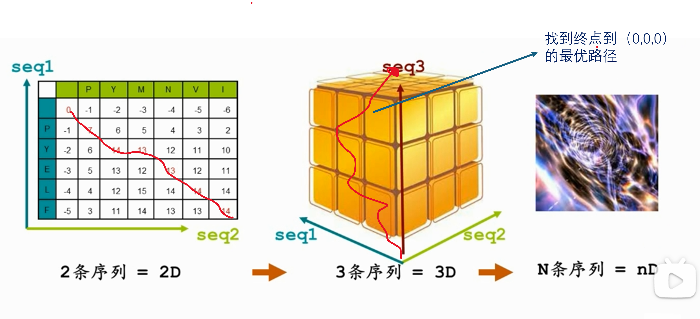

 

* **对要进行多序列比对的序列的要求**:

  * **不能太多的序列**。一般10-15条序列，最好别超过50条

  * **关系太远的序列不行**。两两之间序列相似度低于30%的一组序列作多序列比对会有麻烦。

  * **关系太近的序列不行**。两两之间序列相似度大于90%的序列，有再多条都等于只有一条。

  * **短序列受不行**。多序列比对支持一组差不多长的序列，个别很短的序列属于捣乱分子。

  * **有重复域的序列不行**。如果序列里包含重复域大多数多序列比对的程序都会出错，甚至崩溃。

 

* **给序列起名字的要求**：

  * 序列名字里不要有“空格”，用下划线代替“空格”是个好习惯。

  * 不要使用特殊字符，比如中文，@，#之类的。

  * 序列名字不要太长，最好在 15 个字符以内。

  * 一组序列里，不要有重名的序列。

***
 
 

## 多序列比对multiple alignment网站

* [**EMBL MSA**](https://www.ebi.ac.uk/jdispatcher/msa) 拥有多种多序列比对工具

  * **Clustal**最常用的多序列比对工具，适用于中大型。

  * **TCOFFEE**最新的多序列比对工具之一，适用于中型。
    TCOFFEE 与 CLUSTAL 系列在所使用的算法上类似，准确度上比 CLUSTAL 系列略高，但计算耗时也比 CLUSTAL 系列略高。

  * **MUSCIE**最快的多序列比对工具之一，适用于小型。

***
 
 

* **Clustal 参数设置**

  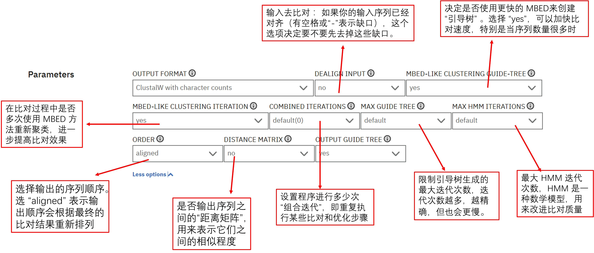

  * **MBED** 是一种快速的序列聚类方法: **MBED** 就像是一个高效的“分组助手”，能快速把大量序列分成不同的组，帮助程序更好地排列这些序列的比对顺序。

  * **引导树(Guide Tree)** 是一种用于指导多序列比对顺序的树状结构，它描述了序列之间的相似性关系。

    **引导树**就像是一个“比对路线图”，帮助程序决定哪两个序列先比对，哪些序列应该放在一起。

    序列越相似，它们在引导树上的分支就越近；序列越不相似，分支就会越远。

    **注意** ：**Guide Tree**不为系统发育树，没有经过距离校正，所以不能当作系统发生树来使用  

 

* **多序列比对结果解读**

| 符号 | 含义                                                         |
| ---- | ------------------------------------------------------------ |
| `*`  | 完全保守的一列，即这一列的残基完全相同。                     |
| `:`  | 残基具有大致相似的分子大小及相同亲疏水性，残基或相同或相似。 |
| `.`  | 残基的分子大小及亲疏水性被一定程度保留，但发生替换，残基不完全相似。 |
| ` `  | 完全不保守的一列。                                           |

| 颜色                                           | 含义                                       |
| ---------------------------------------------- | ------------------------------------------ |
| **Red**         | 疏水性残基（Hydrophobic）                  |
| **Blue**       | 酸性残基（Acidic）                         |
| **Magenta** | 碱性残基（Basic）                          |
| **Green**     | 羟基、胺基、碱性（Hydroxyl, Amine, Basic） |
| **Gray**       | 其他类型残基（Others）                     |

 
 

* **Results Viewers** 标签里，给出了一个**Jalview**的按钮

  [**Jalview**](https://www.jalview.org/)是一款用于多序列比对编辑、可视化和分析的免费程序。 使用它可以查看和编辑序列比对，用系统发生树和主成分分析图分析序列比对，以及探索分子结构和注释。

  
  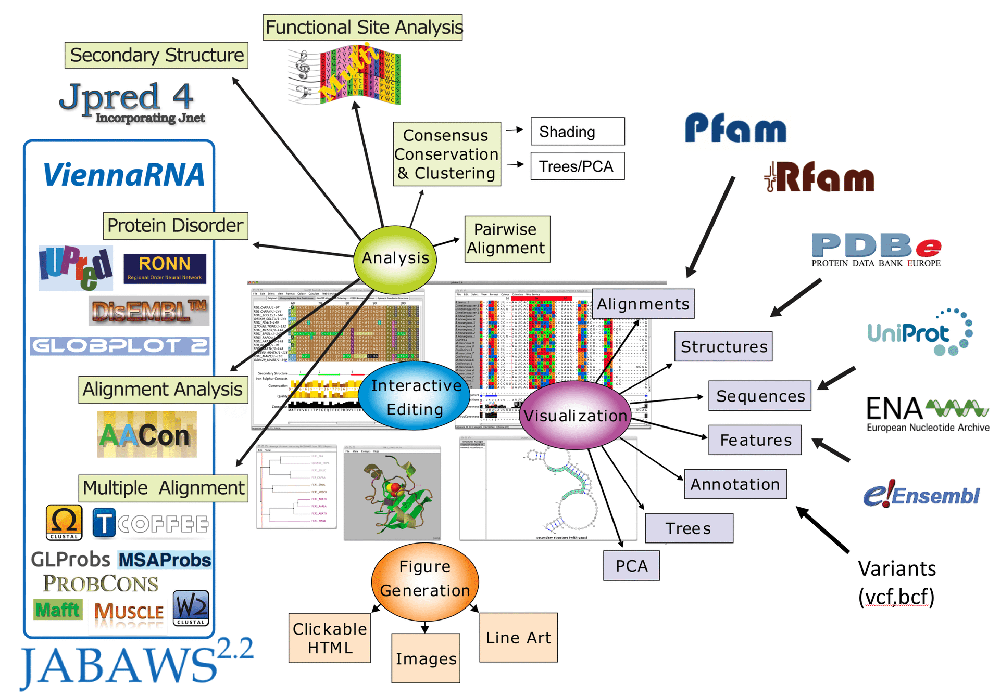 

 
 

* **Results Files** 标签里**Percent Identity Matrix**,可以得到所有序列两两之间的一致度矩阵

  

***
 

* [**TCOFFEE**](https://tcoffee.crg.eu/apps/tcoffee/index.html) 拥有自己的网站，[**TCOFFEE官网**](https://tcoffee.crg.eu/apps/tcoffee/index.html)有很多种变形，也就是说它有更多的功能

| 比对工具      | 序列类型         | 备注                                         |
| ------------- | ---------------- | -------------------------------------------- |
| Expresso      | 蛋白质序列       | 序列加入结构信息后再做多序列比对             |
| M-Coffee      | 蛋白质、RNA、DNA | 综合使用多个流行的比对工具，结合多种比对方法 |
| PSI/TM-Coffee | 跨膜蛋白序列     | 适用于跨膜区域的蛋白质序列比对               |
| PSI-Coffee    | 蛋白质序列       | 专为远源序列打造                             |
| R-Coffee      | RNA序列          | 针对RNA序列的二级结构比对                    |
| SARA-Coffee   | RNA序列          | 针对RNA的三级结构比对                        |
| Pro-coffee    | DNA序列          | 适用于同源启动子区域的DNA序列比对            |

  

***
 

* [**Uniport align**](https://www.uniprot.org/align)使用**Clustal**进行多序列比对

***
 
 

## 寻找保守区域Motif

* 多序列比对中得到什么？答案是你想要找到序列的**保守区域(Motif)**

  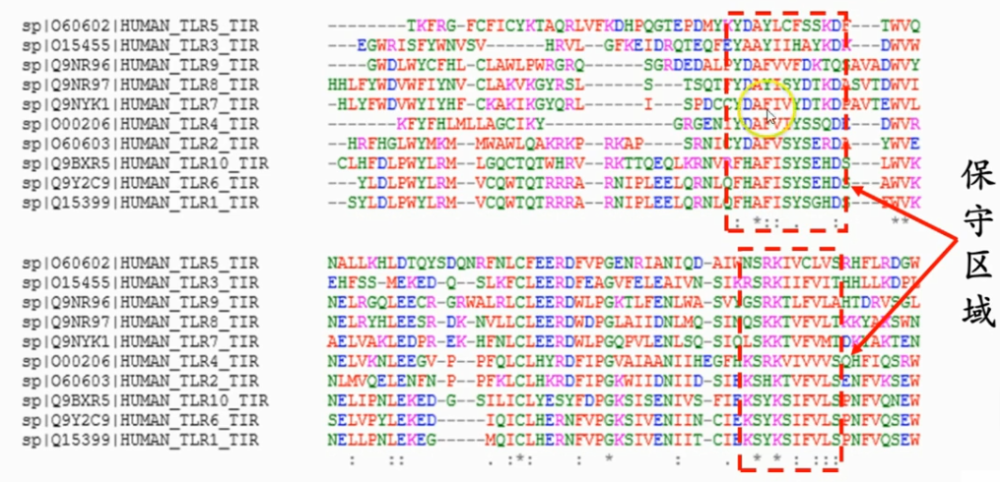

* **序列标识图**就是序列的 logo，它是以图形的方式依次绘出序列比对中各个位置上出现的残基，每个位置上残基的累积可以反应出该位置上残基的一致性。每个残基对应图形字符的大小与残基在该位置上出现的频率成正比

  **如果某一列非常保守，字母高度就高。反之，如果某一列没有什么特征，各种残基都有出现，杂乱无章，那么就会看到一堆比较矮的字母摞在一起。**

   

 

* [**WebLogo**](https://weblogo.threeplusone.com/) 是一款在线创建序列标识图的软件，用户上传**多序列比对的结果**就可以生成**序列标识图**

 

* [**MEME**](http://meme-suite.org/)。**MEME**的使用非常简单，只需要将待分析的序列上传(**上传的序列为原始序列**)即可。

  **MEME**就是一款可以自动从一组相关的核酸或蛋白质序列中发现序列基序的软件, 不需要提前为它们做多序列比对, 还可以motif进行注释

  920

***
 
 

## JASPAR——转录因子图谱

* [JASPAR](https://jaspar.elixir.no/)

* **JASPAR**数据库目前分为两个部分，

  * **JASPAR CORE** 数据库包含一组精心策划的非冗余配置文件，这些配置文件源自已发表的实验定义的真核生物转录因子结合位点集合。

  * **JASPAR UNVALIDATED** 以反映更广泛使用高通量测序方法所产生的更多图谱，而这些图谱的独立验证尚未完成，未能从现有文献中找到任何正交支持。

 

* **JASPAR**能干什么？

  * 查找某个物种的转录因子信息，其结合位点的**序列标识图**

  * [**Profile Inference**](https://jaspar.elixir.no/inference) 输入**转录因子氨基酸序列**，得知这段序列的结合Motif的情况。

  * 选择特定的转录因子，点击右侧蓝色按钮**Add to Cart**，可以对转录因子进行多种分析：

    

      

    * **Scan**：输入一个FASTA 序列格式，判断其Cart中转录因子是否与目标序列结合

    * **Cluster**：对Cart中转录因子使用[STAMP tool](http://www.benoslab.pitt.edu/stamp/)进行聚类

    * **Randomize**：对Cart中转录因子生成随机的DNA 碱基频率矩阵（PFM），它会模仿原本 PFM 的规律，但会在一定范围内引入“随机性”。这样既能保留大致的特征，又不会完全复制原来的数据。
    
    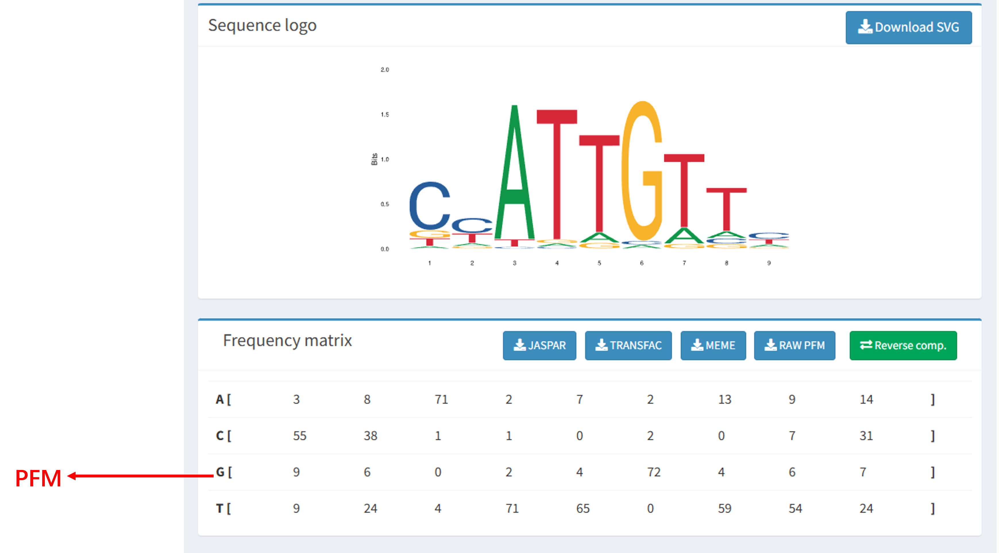

    > 假设你有一个转录因子的 PFM，就像知道了一群人喜欢吃饭的“菜单规律”
    >
    > 早饭 70% 选米饭，30% 选面包
    >
    > 午饭 60% 选面条，40% 选米饭

    > 这个功能就像是“模仿”这个规律，随机生成一批新的菜单
    >
    > 可能是 65% 选面条、35% 选米饭
    >
    > 或者是 72% 选米饭、28% 选面包
    
    * **Permute**：对Cart中转录因子打乱PFM矩阵中的列顺序, 可以选择单个矩阵内列的打乱或多个矩阵之间列的打乱。

***

 
 

# 引物设计

## Primerbank——引物数据库

* [Primerbank官网](https://pga.mgh.harvard.edu/primerbank/)

* 搜索别人设计过的引物

* **缺点**：只限**人**和**小鼠**物种

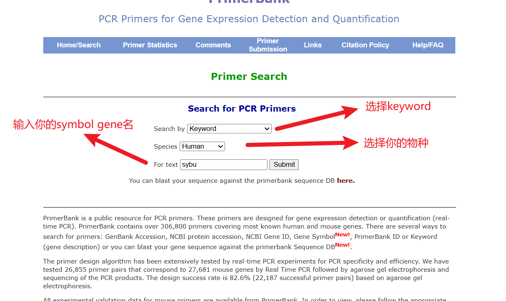

 
 

**最佳选择：引物对间差异不大于2℃；产物长度70-150bp；或经过验证的引物（绿色显示）**

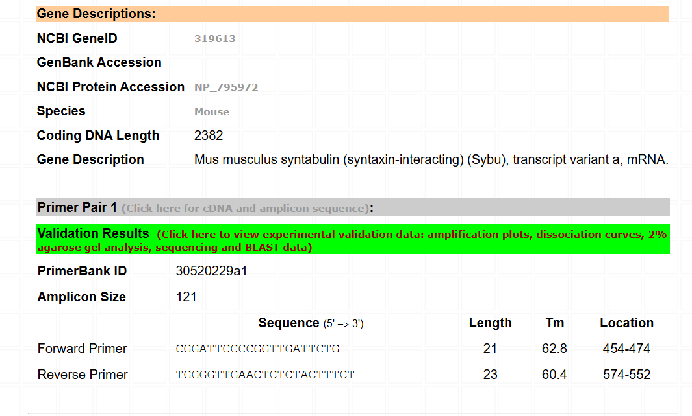

***
 
 

## Primer3Plus——在线设计引物

[pick primers官网](https://www.primer3plus.com/index.html)

<b>简单用法：

* **在main里输入fasta序列**

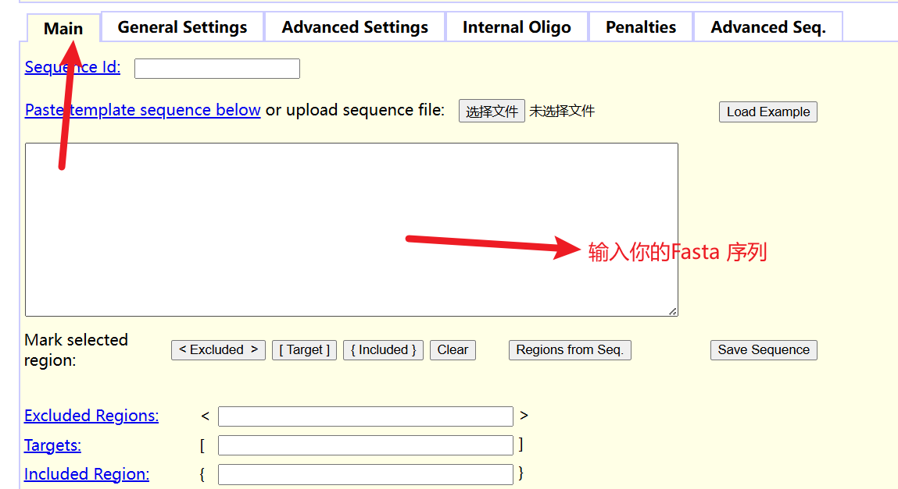

 
 

* **在general setting选项里调整引物的参数**

推荐参数
> **product Size Ranges**: 70—300  
> **prime Size**：18—27，opt:20  
> **prime Tm**：57—63，opt:60  
> **prime Bound%**(引物与目标DNA模板结合强度)：-10(负值表示该参数默认不启用)—110(这个值实际上允许引物与目标DNA的结合强度略微超过100%，通常意味着引物可能与目标序列结合得非常紧密，或者有可能形成某种次级结构、双链或者短暂的结合)，opt:97  
> **prime CG%** ：40—60，opt:50

 
 

* **在Advanced Seq选项里调整上下游引物的位置，在设计鉴定SNP（单个核苷酸改变）位点引物非常有用**

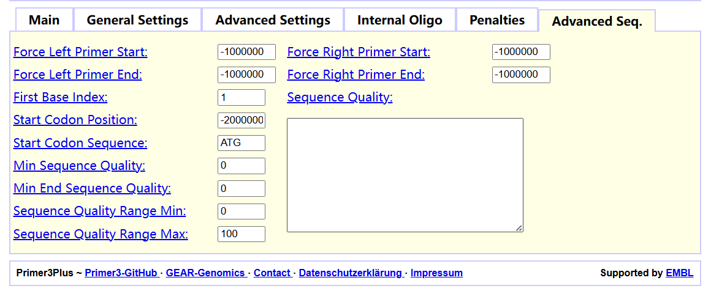

 
 

* **点pick primers系统会根据设计选择最好的十个引物**

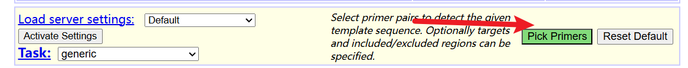

 
 

* **选择比较少的自身二级结构，或其自身二级结构的Tm值离反应温度远的引物**

***
 
 

## Primer-BLAST——引物特异性验证

* [Primer-BLAST官网](#https://www.ncbi.nlm.nih.gov/tools/primer-blast/index.cgi?LINK_LOC=BlastHome)

* 当我们设计好引物时，要验证该引物是否与其他gene发生反应，其**特异性**是否好，这时候就需要用到blast工具了。

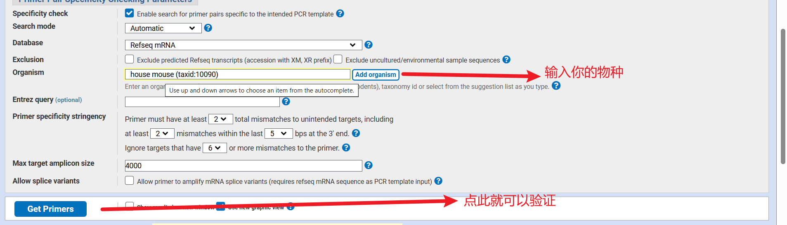

 
 

* 通过blast，我们往下拉可以看到比对出了很多序列。如果结果都是目标gene，且排在前面，则说明该引物的特异性非常好

* 我们选择引物的时候，要选择跟**别的基因转录本匹配差**的特异性引物。

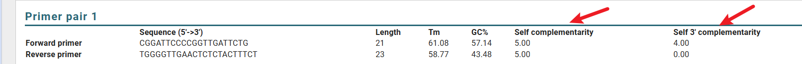

 

>**Self-complementarity**用于预测引物本身甚至引物对之间可能的二级结构。Self complementarity**0-3**为**理想**状态 ，其值**越低越好**。 
>**Self 3' complementarity** 特别关注3'末端的自我互补性，其值**严格**为＜引物自身**1/4碱基数**，其值**越低越好**。

 

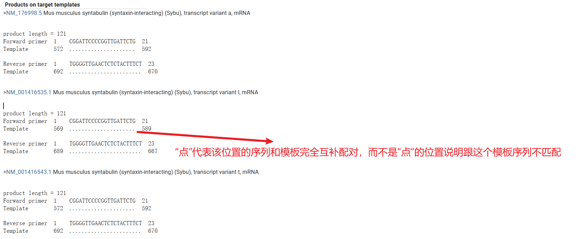

***
 
 

# Other

## 做图和绘图工具

* [BioRender](https://www.biorender.com/)——收费性图工具

***
 
 

##  英文写作润色工具
* [**Quillbot**](https://quillbot.com/ )——AI 写作和语法检查工具

  其拥有插件[chrome插件](https://chromewebstore.google.com/detail/quillbot-ai-writing-and-g/iidnbdjijdkbmajdffnidomddglmieko) | [Edge插件](https://microsoftedge.microsoft.com/addons/detail/quillbot-ai-writing-and-/cphpplikchcioccedpjacdanfibnimmh?product=homepage&referrer=extension_details)

* [**Grammerly**](https://app.grammarly.com/)——AI 写作和语法检查

  其拥有插件[chrome插件](https://chromewebstore.google.com/detail/grammarly-ai-writing-and/kbfnbcaeplbcioakkpcpgfkobkghlhen) | [Edge插件](https://microsoftedge.microsoft.com/addons/detail/grammarly-ai-writing-and/cnlefmmeadmemmdciolhbnfeacpdfbkd)

  其拥有软件，方便你在其他软件上进行英文写作

* [**DeepL**](https://www.deepl.com/zh/translator)——全世界最准确的翻译器

***
 
 

## BioRender——收费性生物绘图工具

* [BioRender官网](https://www.biorender.com/)

* BioRender提供了生命科学领域5000多个图标和常用的分子机制模板

* 但免费版本不能导出高清图片，并且没有版权发表文章

***
 
 

## protocols.io——共享protocol网站

* [protocols.io官网](https://www.protocols.io/)

* **Protocols.io** 是一个开放的在线平台，旨在提供科学实验和研究中详细的实验操作流程（protocols）的共享、存储和优化。其目标是通过**标准化**和公开实验方法来促进科学的可重复性和透明性。

* 有许多论文的实验方法都在**protocols.io**上公布

***
 
 

## ATCC——细胞种类大全

* [ATCC官网](https://www.atcc.org/)

* ATCC是美国菌种保藏中心(American type culture collection)的简写，是世界上最大的生物资源中心。

* 目前，ATCC可以提供以下类别生物标准品：细胞株（3000多种）；菌株（15000多种）；动植物病毒株（2500多种）以及重组物质等。

* 官方网站中可以查询到细胞的**具体来源、培养体系、注意事项、细胞的形态图**等

***
 
 

## 一些宝藏的up主和视频——都点点看看吧！

* [**the bumbling biochemist**](https://www.youtube.com/@thebumblingbiochemist)——讲解了大量生物化学知识，实验小技巧，努力使生物化学变得有趣，让所有人都能理解。 

  * 她本人还创建了一个[网站](https://thebumblingbiochemist.com/)

 
 

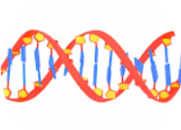

* [**Sanbomics**](https://www.youtube.com/@sanbomics)——生物信息学教程，侧重于RNAseq、单细胞 RNAseq、linux、python、R。

  * 通俗易懂，而且其代码都上传到GitHub上，方便获取

  * 其代表视频有：[2024 updated single-cell guide](https://www.youtube.com/watch?v=FqG_O12oWR4&t=8s) | [Can chatGPT do single-cell bioinformatic analysis?](https://www.youtube.com/watch?v=fkuLFlC2ZWk&t=1s)

 
 

* [**DeepLearningAI**](https://www.youtube.com/@Deeplearningai)——通俗易懂了解机器学习和深度学习原理

  * 入门推荐: [机器学习Deeplearning.ai(b站视频)](https://www.bilibili.com/video/BV1Pa411X76s?vd_source=951f1d2399bb1456eb6ac0a86e6efdd1)，可以帮助我们了解PCA，降维，聚类等这些生物学常见算法的原理。或者运用迁移学习，用别人的模型帮助我们解决生物学问题。
  

 
 

* [**生命中国**](https://space.bilibili.com/19553447)

  * 通俗易懂讲解生物学知识

  * 其中的[新知·旧闻·唠嗑](https://space.bilibili.com/19553447/channel/collectiondetail?sid=331213&spm_id_from=333.788.0.0)专栏会隔断时间通俗易懂讲解一些比较有创新性的生物文章，视频时间也比较短，也容易理解

 
 

 

* [**Lithium_Salt**](https://space.bilibili.com/2947532/?spm_id_from=333.999.0.0)——通俗易懂讲解表观遗传学知识

***
 
 	

